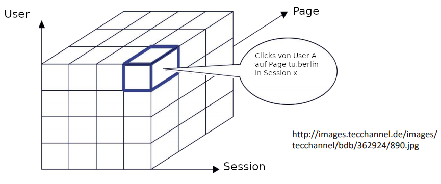
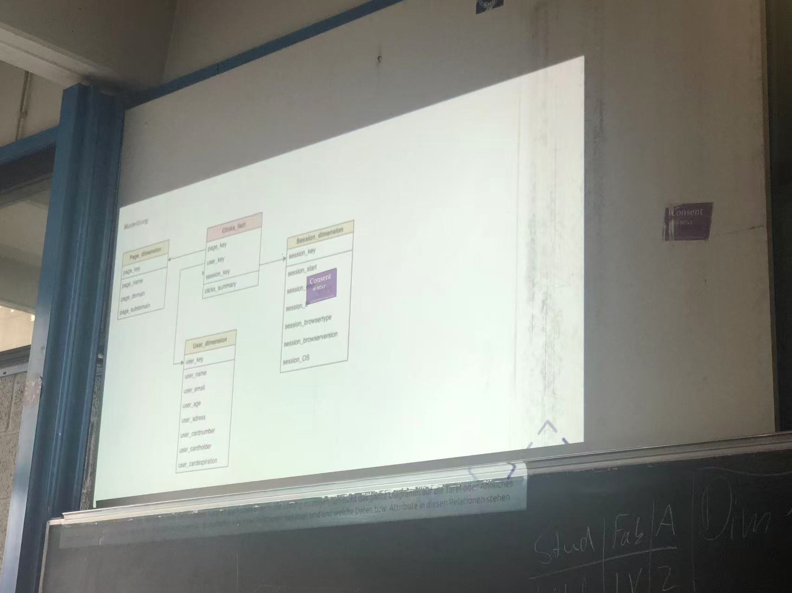
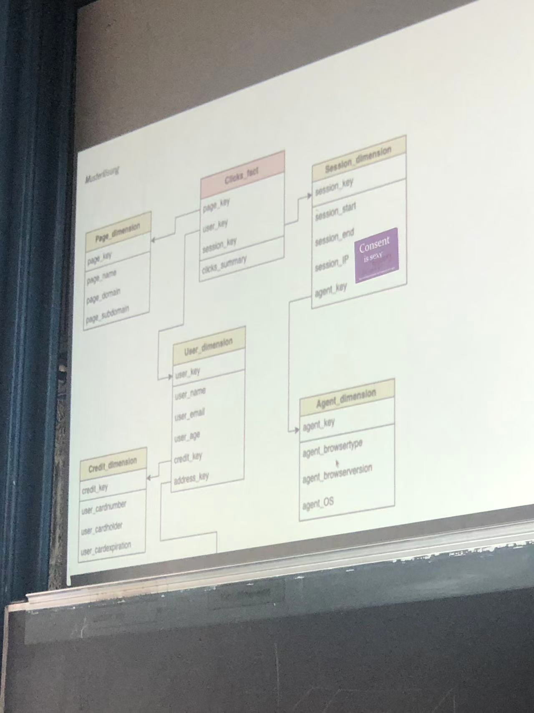
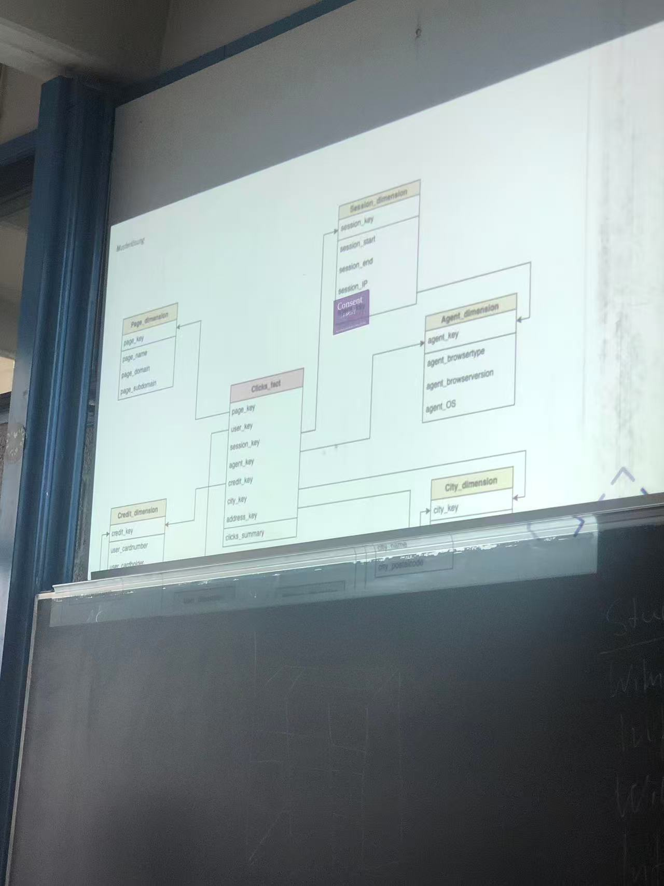
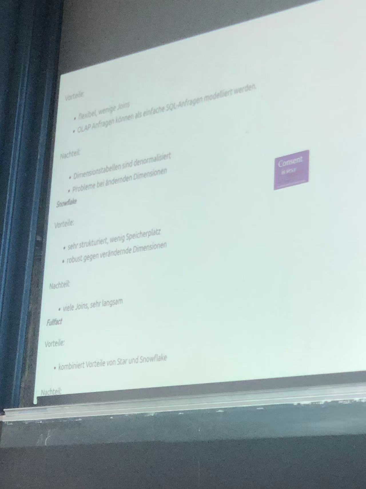
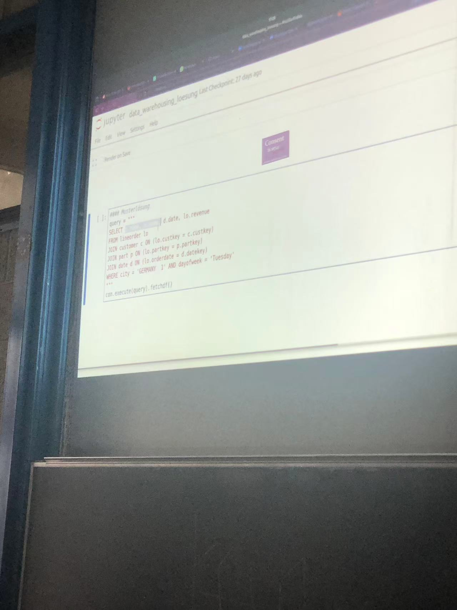

- Aspekte des praktischen betrieblichen Einsatzes von Datenbanksystemen
    - (Relationale) DB beschleunigen die Prozesse enorm!
    - (Relationale) DB erleichtern Datenanalyse enorm!
- Zwei Klassen von Datenbankanwendungen: Online Transaction Processing (OLTP) und Online Analytical Processing (OLAP)
- Einsatz von Datenbanksystemen in Decision-Support-Anwendungen
    - Data Warehouse für die Deskriptiven Fragen
    - Unterscheid zu Data Access: multidimensionales Datenmodell (Orthogonalität)
- Data Warehouse Architektur und Komponenten
    - ETL-Process: Extract Transform Load
    - Datenmodell: OLAP-Würfel (Cube)
    - DWH-Verteilung: Data Marts
    - OLAP-Operationen: Slicing, Dicing, feinere bzw. gröbere Partitionierung Drill down bzw. Roll up
- Datenbankentwurf für das Data Warehouse
    - Faktentabellen
    - Dimensionstabellen
    - Relationale Implementierung (ER, Star, Snowflake, Fullfact)


# 1 Zwei Klassen von DB-Anwendungen: OLTP vs OLAP

## 1.1 OLTP - Online Transaction Processing

==daten schnell schreiben==

− Das Konzept der Transaktion bietet die Möglichkeit, logische Verarbeitungseinheiten auf der Datenbank zu definieren. Unter einer Transaktion wird eine Folge von Datenbankoperationen (Einfügen, Löschen, Modifizieren oder Suche) verstanden, die insb. Bezüglich der Integritätsüberwachung als Einheit (atomar) angesehen wird.


Transaktionen sind nicht prüfungsrelevant, dieser kleine Einschub dient aber der Namensgebung dieser Art von Datenbankverarbeitung, welche im Englischen unter dem Begriff `Online Transactional Processing` oder kurz `OLTP` bekannt ist.


− Formale Anforderungen an Transaktionen (ACID-Prinzip):
    − Atomicity (Atomarität)
    − Consistency (Konsistenz)
    − Isolation (Isolation)
    − Durability (Dauerhaftigkeit)


− Datenbanktheorie im Mehrbenutzerbetrieb
    − Ausführungsplan für Transaktionen (Schedule)
    − Serialisierbarkeit von Ausführungsplänen
    − Konfliktserialisierbarkeit
    − Sperren


## 1.2 Online Analytical Processing

Daten lesen, dauert lange , viele Join 

Data Warehousing hingegen beschäftigt sich mit großen Mengen an historischen Daten (Anfragen brauchen Minuten oder Stunden, um ihr Ergebnis zu bestimmen) und analysiert diese. Da mittels Selektionen, Gruppierungen und Aggregationen Daten analysiert werden, wird diese Art der Datenbankverarbeitung auch als `Online Analytical Processing` oder kurz `OLAP` bezeichnet. Da man in diesem Bereich mit solch großen Mengen an Daten arbeitet, meidet man rechenintensive Operationen wie z.B. Joins, welche wir jedoch je mehr haben, desto mehr wir normalisieren.

− Neben der Verwaltung des Tagesgeschäftes werden Datenbanken auch zur Planung und Analyse eingesetzt:
    − Planung des Tagesgeschäfts (Welche Produkte werden wann, wo benötigt?)
    − Marketing (Was sind meine wichtigsten Kundensegmente?)
    − Marktanalyse (Wer sind meine Konkurrenten?)
    ➔ Analytische Datenbanken
− In analytischen Datenbanken liegt der Fokus auf der Auswertung aktueller und historischer Daten:
    − Annahme: Daten sind statisch (= keine Transaktionen).
    − Sammlung von Daten aus verschiedenen transaktionalen Systemen in einer Zentralen Datenbank (= Data Warehouse).
➔ Analytische Workloads werden unter dem Stichwort „Online Analytical Processing“ oder OLAP zusammengefasst.


## 1.3 OLAP vs OLTP


OLAP - Beispielanfragen
    − Welche Produkte hatten im letzten Jahr im Bereich Potsdam einen Umsatzrückgang um mehr als 10%?
    − Welche Produktgruppen sind davon betroffen?
− Welche Lieferanten haben diese Produkte?
    − Welche Kunden haben über die letzten fünf Jahre eine Bestellung über 50 Euro innerhalb von vier
    Wochen nach einem persönlichen Anschreiben aufgegeben?
    − Wie hoch waren die Bestellungen im Durchschnitt?
    − Wie hoch waren die Bestellungen im Vergleich zu den durchschnittlichen Bestellungen des jeweiligen Kunden in einem vergleichbaren Zeitraum?
    − Lohnen sich Mailing-Aktionen?
− Haben Zweigstellen einen höheren Umsatz, die gemeinsam gekaufte Produkte nebeneinander platzieren?
    − Welche Produkte werden überhaupt zusammen gekauft – und wo?


# 2 Data Warehouse - Architektur

“A Data Warehouse is a subject-oriented, integrated, non-volatile, and time- variant collection of data in support of management‘s decisions.“ 

− Subject-oriented: Verkäufe, Personen, Produkte, etc.
− Integrated: Erstellt aus vielen Quellen
− Persistent: Hält Daten unverändert über die Zeit
− Time-Variant: Vergleich von Daten über die Zeit


## 2.1 DWH - Datenquellen
− Analytische Datenbanken (Data Warehouses) werden periodisch mit den Daten aus operationalen (OLTP) Systemen gefüllt:
    − Lieferantendatenbanken:
        − Produktinformationen: Packungsgrößen, Farben, ...
    − Lieferbedingungen, Rabatte, Lieferzeiten, ...
    − Personaldatenbank:
        − Zuordnung Kassenbuchung auf Mitarbeiter
    − Stundenabrechnung, Prämien
    − Kundendatenbank:
        − Firmennamen, Telefonnummern und Post, E-Mail-Adressen (DSGVO konform)
    − Rechnungssystem:
        − Verbuchte Verkäufe & Einkäufe.
    − Weitere Vertriebswege:
        − Internet, Katalogbestellung, Verkaufsclubs, ...


## 2.2 Extract, Transform & Load (ETL)

− Daten die in das Data Warehouse integriert werden sollen durchlaufen zunächst den sogenannten ETL Prozess:
    − Extraktion: Die Daten werden aus dem Quellsystem exportiert.
    − Transformation: Die Daten werden in das Format des Data Warehouse umgewandelt. (Selektion relevanter Spalten, Anpassen des Formates und der Datentypen, Normalisierung & De-Duplikation, Vor- Aggregationen, Datenvalidierung etc.).
    − Laden: Die transformierten Daten werden in das Data Warehouse importiert.


## 2.3 DWH Architektur & Komponenten


− Physikalische Aufteilung variabel
    − Data Marts auf eigenen Rechnern (Laptop)
    − Staging Area auf eigenen Servern
    − Metadaten auf eigenem Server (Repository)


Arbeitsbereich
− Staging Area
    − Temporärer Speicher
    − Quellnahes Schema
− Motivation
    − ETL Arbeitsschritte effizienter implementierbar
        − Mengenoperationen, SQL
    − Zugriff auf Basisdatenbank möglich (Lookups)
    − Vergleich zwischen Datenquellen möglich
    − Filterfunktion: Nur einwandfreie Daten in Basisdatenbank übernehmen


Basisdatenbank
− Zentrale Komponente des DWH
    − Begriff „DWH“ meint oft nur die Basisdatenbank.
− Speichert Daten in feinster Auflösung
    − Einzelne Verkäufe
    − Einzelne Bons
− Historische Daten
− Große Datenmengen
    − Spezielle Modellierung
    − Spezielle Optimierungsstrategien


Data Mart
− Ein Data-Mart ist eine Kopie des Teildatenbestandes eines Data Warehouse, die für einen bestimmten Organisationsbereich oder eine bestimmte Anwendung oder Analyse erstellt wird.
− Gründe für das Arbeiten mit einem Data-Mart ("Kopien" aus dem Data-Warehouse):
    − die Notwendigkeit spezieller Datenstrukturen (die in dieser Form nicht im DW vorhanden sind) für bestimmte Analysen,
    − bessere Leistung: Verlagerung von Rechnerleistung auf einen anderen Rechner,
    − Eigenständigkeit der Anwender (z. B. Mobilität, Unabhängigkeit von anderen Organisationsbereichen),
    − Zugriffsschutz: Abgrenzung gegenüber anderen Nutzern


# 3 Mehrdimensionale Modellierung: Datenmodell für DWH


Das Mehrdimensionale Datenmodell
− In Data Warehouses werden Daten im sogenannten mehrdimensionalen Datenmodell dargestellt:
    − Spezielles Datenmodell für analytische Anfragen (ungeeignet für OLTP).
        − Fokus: Schnelle Aggregation und Analyse der Daten.
        − Kein Fokus: Normalisierung, verhindern von Redundanz, „Wartbarkeit“.

数据仓库中使用所谓的“多维数据模型”来表示数据：
    这是一种专门为分析型查询设计的数据模型（不适合用于 OLTP（联机事务处理））。
        重点：快速对数据进行聚合和分析。
        不强调：范式化、冗余消除、易维护性等传统关系数据库设计原则。

---

− Die Daten sind unterteilt in:
    − ==Fakten: Relevante, messbare Daten (z.B. Verkäufe).==
    − ==Dimensionen: Beschreiben die Fakten (z.B. Produkt, Ort, Zeit).==
    − Dimensionen sind in der Regel hierarchisch organisiert:
        − Zeit: All ⊃ Jahr ⊃ Quartal ⊃ Monat ⊃ Woche ⊃ Tag ⊃ Stunde ⊃ Minute
        − Ort: All ⊃ Kontinent ⊃ Region ⊃ Land ⊃ Landkreis ⊃ Ort ⊃ Filiale
        − Produkt: All ⊃ Produktkategorie ⊃ Unterkategorie ⊃ Produkt


Dimensionen
− Eindeutige Strukturierung des Datenraums
− Jede Dimension hat ein Schema
    − Tag, Woche, Jahr
    − Landkreis, Land, Staat
    − Produkt, Produktgruppe, Produktklasse, Produktfamilie
− ... und Wertebereiche
    − (1, 2, 3, ..., 31), (1, ... 52), (1900, ..., 2017)
    − (...), (Berlin, NRW, Department-1, ...), (D, F, Pl ...)


---

− Typische OLAP Anfrage: Aggregiere Fakten nach Dimensionen.
    − Insbesondere: Entlang von Dimensionshierarchien.

聚合事实数据，按照维度进行分组统计。
常见操作包括：
    Drill-Down（下钻）：从“年”下钻到“月”、“日”；
    Roll-Up（上卷）：从“日”上卷到“月”、“年”；
    Slice / Dice：选取某一维度的特定值或切片分析；
    Pivot（旋转）：交换维度的展示方式。


# 4 OLAP - Operationen

## 4.1 Slicing 切条 und Dicing  切块

Wenn wir dann einmal Daten zum Verarbeiten haben, dann können wir auf diesen wie gehabt SQL-Anfragen stellen. Dabei haben wir schon zuvor erwähnt, dass diese Anfragen einen analytischen Fokus haben. So werden Selektionen (WHERE) genutzt, um einzelne Abschnitte (Slices) aus dem Würfel zu schneiden und Gruppierungen (GROUP BY) um den Würfel oder einen Teil davon in mehrere kleinere Würfel zu zerlegen (Dices).


- Slicing: Auswahl von bestimmten Einträgen in dem Cube in einer oder mehrerer Dimensionen.
- Dicing: Partitionieren des Basisdaten-Cube in einen gröberen Cube.
- Der durch Dicing erzeugte Cube enthält aggregierte Daten (hier: Summe der Profite) statt der Einzelverkäufe im Basisdaten-Cube


Hierarchische Dimensionen → unterschiedliche granulare Partitionen


## 4.2 Drill down und Roll up


 Drill down: Feinere Partitionierung und/oder stärkere Selektion
Roll up: Gröbere Partitionierung → Stärkere Verdichtung


## 4.3 ROLLUP Operator  and Cube Opeator 

Wie sich das Thema des Data Warehousing weiterentwickelt hat, so haben sich typische Anfragen ergeben, welche sehr beliebt sind, jedoch verhältnismäßig schwer in SQL zu schreiben sind, weshalb man für diese Anfragen unterschiedliche eingeführt hat.

Als Beispiel werden wir für beide Operationen Durchschnittsnoten nehmen. Der Einfachheit nehmen wir an, dass die Daten passend für uns aufbereitet sind

Der ROLLUP-Operator erzeugt eine Ergebnismenge mit hierarchischen Aggregationsstufen; dies bedeutet, dass der ROLLUP-Operator unterschiedliche Anfragen im Hintergrund bildet, dessen Zwischenergebnisse vereinigt werden. Dabei wird die Gruppierung sukzessiv gröber. Diese Eigenschaft ist entscheidend für die Durchführung von Drill-Down- und Roll-Up-Analysen in OLAP. Durch Verwendung des ROLLUP-Operators können Benutzer Daten auf verschiedenen Ebenen der Hierarchie zusammenfassen oder aufteilen, um unterschiedliche Analyseebenen zu betrachten.

### 4.3.1 Roll up Operation: hierarchische Aggregation


---

ROLLUP Operator
- Herkömmliches SQL
    - Dimension mit k Stufen – Union von k Queries
    - k Scans der Faktentabelle
        - Keine Optimierung wg. fehlender Multiple-Query Optimierung in kommerziellen RDBMS
    - Schlechte Ergebnisreihenfolge
- ROLLUP Operator
    - Hierarchische Aggregation mit Zwischensummen
    - Summen werden durch „ALL“ als Wert repräsentiert


**传统 SQL**：

- 如果你想对某个具有 `k` 个层级的维度（比如时间：年、月、日）做聚合分析，需要写 **`k` 个 UNION 查询**，每个查询对应一个聚合层级。
- 这意味着需要对**事实表扫描 k 次**，效率很低。
- 商业关系数据库管理系统（RDBMS）**通常不支持多查询（Multiple-Query）优化**，因此性能很差。
- 查询结果的行顺序也不好控制（**结果排序差**）。


**ROLLUP 操作符**：

- 用于在 SQL 中实现**维度层级的聚合（Hierarchische Aggregation）**，包括每一级别的**小计（Zwischensummen）**。
    
- 在结果中，自动**添加总计和小计行**，每一层的聚合用 `ALL` 或 `NULL` 来表示维度的“汇总”状态


|Jahr|Monat|Umsatz|
|---|---|---|
|2024|Jan|100|
|2024|Feb|120|
|2025|Jan|130|
使用 `ROLLUP(Jahr, Monat)` 得到的结果可能是：

|Jahr|Monat|Umsatz|
|---|---|---|
|2024|Jan|100|
|2024|Feb|120|
|2024|NULL|220 ← 小计：2024 年总和|
|2025|Jan|130|
|2025|NULL|130 ← 小计：2025 年总和|
|NULL|NULL|350 ← 总计：所有数据总和|

注意：这里的 `NULL` 就是 `ALL` 的表示方式，意味着“在这个维度上聚合所有”。


---

Bsp.: Die Durchschnittsnote aller Studierenden, die Durchschnittsnoten aller Studierenden pro Studiengang und die Durchschnittsnoten aller Studierenden pro Fakultät und Studiengang.

```
SELECT Studiengang, Fakultät, AVG(Note)
FROM Student
GROUP BY  ROLLUP(Studiengang, Fakultät)
```

Die Anfrage ist somit äquivalent zu folgender Anfrage.

```
SELECT Studiengang, Fakultät, AVG(Note)
FROM Student
GROUP BY Studiengang, Fakultät

UNION 

SELECT Studiengang, NULL AS Fakultät, AVG(Note)
FROM Student
GROUP BY Studiengang

UNION 

SELECT NULL AS Studiengang, NULL AS Fakultät, AVG(Note)
FROM Student
```

### 4.3.2 CUBE Operator

Der CUBE-Operator erzeugt eine Ergebnismenge, in der alle Gruppierungssets des Kreuzprodukts der Gruppierungsattribute miteinander vereinigt werden. Der CUBE-Operator bildet somit das Kreuzprodukt aus den ihm übergebenen Attributen und vereinigt dann die Ergebnisse aus

Teilanfragen. Diese Funktionalität ist äußerst nützlich in OLAP-Szenarien, in denen Benutzer multidimensionale Analysen durchführen möchten.

Bsp.: Die Durchschnittsnote aller Studierenden, die Durchschnittsnoten aller Studierenden pro Fakultät, die Durchschnittsnote pro Studiengang und die Durchschnittsnoten aller Studierenden pro Fakultät und Studiengang.


− d Dimensionen, jeweils eine Klassifikationsstufe
    − Jede Dimension kann in Gruppierung enthalten sein oder nicht
    − 2d Grupierungsmöglichkeiten

 基础概念：

    有 d 个维度（Dimensionen），每个维度只有一个分类层级（即没有层级结构）。

        每个维度可以被包含或不被包含在分组中。

        因此，共有 2^d（2 的 d 次方）种分组方式（包括全维度聚合、单维度聚合、无聚合等所有组合）。

---


− Herkömmliches SQL
    − Viel Schreibarbeit
    − 2d Scans der Faktentabelle (wieder keine Optimierung möglich)

在传统 SQL 中：

    编写这些组合的 SQL 查询非常繁琐（Viel Schreibarbeit）。

    为每种分组方式都要扫描一次事实表，造成 2^d 次扫描，性能极差。

    商业数据库系统通常 不支持多查询优化（Multiple-Query Optimization），所以无法提升效率。


---


− CUBE Operator
    − Berechnung der Summen von sämtlichen Kombinationen der Argumente (Klassifikationsstufen)
    − Summen werden durch „ALL“ repräsentiert
    − Keine Beachtung von Hierarchien
        − Durch Schachtelung mit ROLLUP erreichbar

CUBE 操作符的优势：

    CUBE 能一次性计算所有维度组合的聚合值（即所有分类组合的总和）。

    聚合结果中的“汇总”使用 "ALL" 来表示。

    它不考虑维度之间的层级结构（比如时间中的 年 ⊃ 月 ⊃ 日）。


假设你有两个维度：`Land`（国家） 和 `Produkt`（产品）：

```sql
SELECT Land, Produkt, SUM(Umsatz)
FROM Verkäufe
GROUP BY CUBE(Land, Produkt);

```

这会生成以下聚合：

- 每个国家、每个产品的销售额
    
- 每个国家的总销售额（所有产品）
    
- 每个产品的总销售额（所有国家）
    
- 所有国家 + 所有产品的总体销售额
    

结果表中，用 `NULL`（或 `ALL`）来表示聚合维度的“全部”。


---

例子
Bsp.: Die Durchschnittsnote aller Studierenden, die Durchschnittsnoten aller Studierenden pro Fakultät, die Durchschnittsnote pro Studiengang und die Durchschnittsnoten aller Studierenden pro Fakultät und Studiengang.

```
SELECT Studiengang, Fakultät, AVG(Note)
FROM Student
GROUP BY  CUBE(Studiengang, Fakultät)
```

Die Anfrage ist somit äquivalent zu folgender Anfrage.
```
SELECT Studiengang, Fakultät, AVG(Note)
FROM Student
GROUP BY Studiengang, Fakultät

UNION 

SELECT Studiengang, NULL AS Fakultät, AVG(Note)
FROM Student
GROUP BY Studiengang

UNION 

SELECT NULL AS Studiengang, Fakultät, AVG(Note)
FROM Student
GROUP BY Fakultät

UNION 

SELECT NULL AS Studiengang, NULL AS Fakultät, AVG(Note)
FROM Student
```

### 4.3.3 Cube 和 Rollup 比计较 


`CUBE` 和 `ROLLUP` 是 SQL 中用于 **多维数据分析（OLAP）** 的两个聚合操作符，它们都可以在 `GROUP BY` 子句中使用，用于自动生成**分组聚合结果（aggregates）**，但它们的用途和行为有明显的不同。

| 特性                  | `ROLLUP`               | `CUBE`                 |
| ------------------- | ---------------------- | ---------------------- |
| 目的                  | 沿 **维度层级顺序** 逐级聚合      | 生成所有 **维度组合** 的聚合      |
| 聚合组合数量              | `n + 1`（n 个维度 + 总计）    | `2^n`（所有可能的组合）         |
| 是否考虑维度的顺序           | ✅ 是的（顺序重要）             | ❌ 否（顺序无关）              |
| 是否支持维度层级（hierarchy） | ✅ 支持（适用于有层次的维度）        | ❌ 不支持（所有维度平等）          |
| 聚合方式                | 顺序汇总，从明细到总计            | 所有维度的**每一种组合**都汇总      |
| 使用场景                | 财务报表、时间序列分析（年 > 月 > 日） | 多维交叉分析（如 产品 × 地区 × 时间） |


假设我们有一个销售表 `sales`，包含字段：`Region`, `Product`, `SalesAmount`


1 
```
SELECT Region, Product, SUM(SalesAmount)
FROM sales
GROUP BY ROLLUP(Region, Product);

```
结果：

    每个 Region + Product 的销售总额

    每个 Region 的总销售额（所有产品）

    所有地区和所有产品的总销售额（汇总）


```
Region   | Product   | Sum
---------|-----------|-----
East     | Apple     | 100
East     | Banana    | 150
East     | NULL      | 250   ← East 汇总
West     | Apple     | 120
West     | Banana    | 130
West     | NULL      | 250   ← West 汇总
NULL     | NULL      | 500   ← 总汇总

```


2 使用 `CUBE`：

```
SELECT Region, Product, SUM(SalesAmount)
FROM sales
GROUP BY CUBE(Region, Product);

```

结果：

    Region + Product（明细）

    Region 的总和（所有产品）

    Product 的总和（所有 Region）

    所有数据的总和（全部 Region + Product）


```
Region   | Product   | Sum
---------|-----------|-----
East     | Apple     | 100
East     | Banana    | 150
East     | NULL      | 250   ← East 汇总
West     | Apple     | 120
West     | Banana    | 130
West     | NULL      | 250   ← West 汇总
NULL     | Apple     | 220   ← Apple 汇总
NULL     | Banana    | 280   ← Banana 汇总
NULL     | NULL      | 500   ← 总汇总

```


|你想要…|使用哪个？|
|---|---|
|沿某个顺序进行层次聚合|✅ `ROLLUP`|
|所有维度组合都统计|✅ `CUBE`|
|对数据的多角度切片分析（slice）|✅ `CUBE`|
|分析某个维度随时间的变化|✅ `ROLLUP`|
|简化复杂的 `UNION ALL` 语句|两者都可以|


# 5 Relationale Implementierung von DWH


Relationale Implementierung - Schemata
− ER - Schema
    − Relationen für Fakten und für Dimensionen sind normalisiert.
    − Mehrere Relationen für die Fakten.
− Star
    − Relationen für Fakten sind normalisiert, für Dimensionen bewusst denormalisiert.
− Snowflake
    − Relationen für Dimensionen normalisiert.
    − Eine normalisierte Relation für die Fakten.
    − Zeit-Dimension wird normalerweise nicht normalisiert.
− Fullfact
    − Relation für Fakten nicht normalisiert.
    − Relation für Fakten hält Fremdschlüssel für Dimensionen jeder Hierarchiestufe.
    − Relationen für Dimensionen normalisiert.


Sternschema
Im Sternschema existiert genau eine Tabelle pro Dimension, plus die Faktentabelle, welche die unterschiedlichen Dimensionen miteinander verbindet.

Schneeflockenschema
Das Schneeflockenschema ist eine Erweiterung des Sternschemas, da die Dimensionen normalisiert sind. Das Schneeflockenschema hat somit mindestens genau so viele Relationen wie das Sternschema, häufig aber deutlich mehr.

Fullfact-Schema
Das Fullfact-Schema versucht dann eine Balance zwischen den beiden zu finden, indem die Dimensionsrelationen normalisiert werden, deren Schlüssel aber auch einen Eintrag in der Faktentabelle erhalten.


## 5.1 ER - Schema


Warum kein ER-Schema
− Normalisierte ER Schemas sind für OLTP Anwendungen optimiert:
    − Ziel: Einfaches Verändern / Hinzufügen / Löschen.
    − Normalisierung verhindert Einfüge / Lösch / Update Anomalien.
    − Transaktionen müssen nur wenige Einträge sperren.
        ➔ Optimiert auf Schreiboperationen.
− In OLAP Anwendungen haben wir andere Anforderungen:
    − Aggregation benötigt de-normalisierte Daten.
        − Normalisiertes Schema ➔ Viele Joins ➔ Teure Operationen!
    − Viele Tabellen machen den ETL Prozess aufwendiger.
    − Idee: Speichere Daten de-normalisiert.
        − Keine Updates in OLAP Anwendungen ➔ Keine Anomalien!
        − Weniger Tabellen erlauben schnellere Anfragen.
        ➔ Optimiert auf Leseoperationen.

## 5.2 Star 


Im Sternschema existiert genau eine Tabelle pro Dimension, plus die Faktentabelle, welche die unterschiedlichen Dimensionen miteinander verbindet.

Star-Schema:
− Vorteile:
    − Flexibles Modell, sehr einfach zu modellieren.
    − OLAP Anfragen können als einfache SQL Anfragen modelliert werden.
− Nachteile:
    − Dimensionshierarchien sind „versteckt“, nicht offensichtlich.
    − Dimensionstabellen sind de-normalisiert: Problematisch wenn sich Dimensionen über die Zeit ändern („Slowly Changing Dimensions“).


## 5.3 Snowflake


Snowflake-Schema:
    − Vorteile:
        − Wie beim Sternschema, aber robuster gegen sich ändernde Dimensionen.
    − Nachteile:
        − Benötigt aber mehr Joins ➔ Langsamere Anfragen!

Das Schneeflockenschema ist eine Erweiterung des Sternschemas, da die Dimensionen normalisiert sind. Das Schneeflockenschema hat somit mindestens genau so viele Relationen wie das Sternschema, häufig aber deutlich mehr.


## 5.4 Fullfact 


− Hybrid aus Star- & Snowflake-Schema:
− Normalisierte Dimensionen / Denormalisierte Faktentabelle.
− ==Faktentabelle enthält PK Relation auf alle hierarchischen Dimensionstabellen==

− Vorteile:
− Kombiniert Vorteile von Star- & Snowflake-Schema.
− Außerdem: Teilweise schneller als Schneeschema:
    − Direkter FK Verweis auf alle Hierarchien erlaubt Filtern nach allen Dimensionstiefen ohne Join.
    − Beispiel:
        − Star-Schema: Filtern nach Monat benötigt Join mit Zeit, da monat_id nur in Dimension vorhanden.
        − Fullfact: Direktes Filtern nach Monat ohne Join, da monat_id in der Faktentabelle vorhanden.


Aber: Zusätzliche Attribute blähen Faktenabelle auf
➔ Deutlich gesteigerter Speicherbedarf.
➔ Evtl. langsamere Anfragen, da mehr Daten geladen werden müssen


# 6 Wrap up 


# 7 Aufgabe 

## 7.1 Aufgabe 1

Gegeben sind die unten stehenden Anwendungsszenarien; kategorisieren Sie diese als OLAP- oder OLTP-Anfragen?

1. Kassenverwaltung im Supermarkt.  OLTP 
    
2. Auswirkung von Werbekampagnen auf Verkaufszahlen bestimmen:  OLAP
    
3. Ticketwebseite für Konzerte.: OLTP
    
4. Überwachung des Flugraums (Fluglotsen): OLAP
    
5. Identifizieren der wichtigsten Kunden: OLAP
    
6. „Wird oft zusammen gekauft“ (z.B. bei Amazon). :OLAP 


## 7.2 Aufgabe 2




Der Würfel beschreibt die Clickstream-Datenbank. Diese ist eine einfache Datenbank, welche eine Aufzeichnung der von einem Benutzer auf einer Website getätigten Klicks speichert.

Eine solche Datenbank kann zum Beispiel benutzt werden für:

- Marketing
    
- Click Fraud Detection
    
- Verbesserung des Websitedesigns
    

Für die Modellierungen gelten die folgenden Eigenschaften:

- Dimensionen: Page, User, Session
    
- Eine Zelle beschreibt eine Zusammenfassung der Klicks, die ein bestimmter Nutzer in einer bestimmten Session auf einer bestimmten Page getätigt hat.
    
- Beachte: Logische Repräsentation, die meisten Zellen sind leer!
    

User haben die folgenden Attribute:

- Name, Email, Alter, Adresse, Kreditkartennummer, Kreditkarteninhaber, Kreditkartenablaufdatum,
    

Session hat die folgenden Attribute:

- Sessionstart, Sessionende, IP, Browsertyp, Browserversion, Betriebssystem
    

Page hat die folgenden Attribute:

- Seitenname, Seitendomain, Seitensubdomain


### 7.2.1 Aufgabe 2.1 Modellierung

Im Folgenden modellieren Sie die Klicks mittels aller drei Schemata, welche Sie in diesem Modul zu Data Warehousing kennengelernt haben.

#### 7.2.1.1 Aufgabe 2.1.1: Sternschema

Modellieren Sie die Klicks in einem Sternschema.

braucht 
- fact table:  click_facts
- demension table :  session diemension, Page diemension, User diemension,



#### 7.2.1.2 Aufgabe 2.1.2: Schneeflockenschema

Modellieren Sie die Klicks in einem Schneeflockenschema.

weleche nicht demensioniert werden kann:  Adresse in User table 



#### 7.2.1.3 Aufgabe 2.1.2: Fullfact-Schema

Modellieren Sie die Klicks in einem Fullfact-Schema.

==Faktentabelle enthält PK Relation auf alle hierarchischen Dimensionstabellen==





### 7.2.2 Aufgabe 2.2 Vergleich der Schemata

Wie viele Joins benötigen wir in jedem Schema, um für alle Nutzer aus Berlin, die am 21.06.21 auf der Seite [dima.tu-berlin.de](http://dima.tu-berlin.de) waren, die Daten auszuwerten?

### 7.2.3 Aufgabe 2.3

Was sind die Vorteile und Nachteile der jeweiligen Schemata?

Fullstack-schema:  viele Speicher verbraucht, aber weniger Zeit , da Verbindung mehr ist, und schon  Verbindung wird schon aufgebaut in Fullstack-schema




## 7.3 Aufgabe 3

Gegeben sei das folgende **Sternschema** zum Modellieren einer Verkaufsdatenbank aus dem Star-Schema-Benchmark. 

Dieser OLAP-Würfel hat 5 Dimensionen, die als Dimensionstabellen modelliert sind: Customer, Supplier, Part sowie Orderdate und Commitdate.

Außerdem gibt es noch weitere Dimensionen, die direkt in der Faktentabelle modelliert sind, z.B. orderpriority und shippriority.

Als Erstes laden wir die Beispieldatenbank:

import duckdb

```
con = duckdb.connect(database="resources/08_data_warehousing/ssb.duckdb", read_only=False)
```

---------------------------------------------------------------------------
```
IOException                               Traceback (most recent call last)
Cell In[1], line 3
      1 import duckdb
----> 3 con = duckdb.connect(database="resources/08_data_warehousing/ssb.duckdb", read_only=False)

IOException: IO Error: Cannot open file "/builds/dima/isda/isda-sose25/08_data_warehousing/resources/08_data_warehousing/ssb.duckdb": No such file or directory
```

Zuerst testen wir die Datenbankverbindung, indem wir die Anzahl der Einträge in der Faktentabelle zählen.

```
query = """
SELECT count(*)
FROM lineorder
"""
con.execute(query).fetchdf()
```


### 7.3.1 Aufgabe 3.1: Drill down mittels Dicing und Slicing

Die Faktentabelle enthält ca. 60000 Zeilen. Jeder Eintrag ist ein einzelner Bestellposten.

(Ein Bestellposten ist Teil einer Bestellung und besteht unter anderem aus einem Produkt und der Anzahl des Produkts. Stellen Sie sich eine Rechnung eines Gemüsehändlers vor, mit 10 Äpfeln und 20 Birnen. Dann sind z.B. die 10 Äpfel ein Bestellposten, d.h., 1 Eintrag in der Faktentabelle.)

Die Datenbank enthält nur Bestellungen aus dem Januar 1992.

Im Folgenden führen wir ein Drill down mittels Dicing und Slicing durch.

Zuerst führen wir ein Dicing durch. Wir erstellen einen OLAP-Würfel, der den Umsatz (revenue) gruppiert nach Jahr des Bestelldatums und der die Herkunftsregion der Käufer beinhaltet.


```
query = """
SELECT year, region, sum(revenue)
FROM lineorder l 
JOIN date d ON (l.orderdate = d.datekey) 
JOIN customer c ON (l.custkey = c.custkey)
GROUP BY year, region
"""
con.execute(query).fetchdf()
```


Der OLAP-Würfel hat 2 **Dimensionen**: Bestelldatum und Käufer. Die Granularität der Bestelldatum-Dimension ist Jahr und die Granularität der Käufer-Dimension ist Region.

**Granularität**: Granularität bezieht sich auf das Detailniveau, auf dem Daten analysiert oder gespeichert werden, und bestimmt das Maß an Spezifität oder Aggregationsgrad der Daten.


#### 7.3.1.1 Aufgabe 3.1.1: Dicing

Erstellen Sie einen OLAP-Würel, der den Umsatz der Bestellungen gruppiert nach Jahr, Monat und Wochentag (dayofweek) und nach dem Land der Käufer gruppiert ist.

- Wie viele Dimensionen hat dieser OLAP-Würel?
    -  nur zwei (orderdate und customer) . year, month, dayofweek sind die Attribute zum orderdate
- Was ist die Granularität der Dimensionen?
    - dayofweek and Nation 
        - dayofweek ist abhangig von month, aber month ist nicht abhangig von dayofweek 

```
query = """

SELECT year, month, dayofweek, nation, sum(revenue)
FROM lineorder l, 
JOIN date d ON (l.orderdate = d.datekey) 
JOIN customer c ON (l.custkey = c.custkey)
GROUP BY year, month, dayofWeek, nation

"""
con.execute(query).fetchdf()
```

#### 7.3.1.2 Aufgabe 3.1.2: Slicing

Verfeinern Sie den bestehenden OLAP-Würfel, in dem sie nur die Umsatzsummen an Dienstagen und in Europa ausgeben.

- Wie viele Dimensionen hat dieser OLAP-Würfel?
    
- Was ist die Granularität der Dimensionen?
    

```
query = """
SELECT year, month, dayofWeek, nation, sum(revenue)
FROM lineorder l, 
JOIN date d ON (l.orderdate = d.datekey) 
JOIN customer c ON (l.custkey = c.custkey)
WHERE dayofweek='Tuesday' AND region='EUROPE'
GROUP BY year, month, dayofWeek, nation
"""
con.execute(query).fetchdf()
```

#### 7.3.1.3 Aufgabe 3.1.3: Slicing und Dicing

Verfeinern Sie den vorherigen OLAP-Würfel, in dem sie nur Einträge in Deutschland auswählen und gleichzeitig nach den Städten der Käufer gruppieren. Zählen Sie außerdem ==die Anzahl der Einträge== in jeder Gruppe.

- Wie viele Dimensionen hat dieser OLAP-Würfel?
    
- Was ist die Granularität der Dimensionen?
    

```
query = """
SELECT year, month, dayofWeek, region, city, sum(revenue), count(*)
FROM lineorder l, 
JOIN date d ON (l.orderdate = d.datekey) 
JOIN customer c ON (l.custkey = c.custkey)
WHERE dayofweek='Tuesday' AND region='GERMANY'
GROUP BY year, month, dayofWeek, city
"""
con.execute(query).fetchdf()
```

#### 7.3.1.4 Aufgabe 3.1.4: Ausgabe der Werte für eine Stadt

Geben Sie die Bestellposten aus, die an einem Dienstag in Deutschland in der Stadt ‘GERMANY 1’ (zwei Leerzeichen zwischen Germany und 1) verkauft wurden.

Es sollten ausgegeben werden:
- Das Datum der Bestellung (date.date).
- Der Name des Käufers.
- Der Name des Produkts.
- Der Umsatz (revenue).


```
query = """
"""
con.execute(query).fetchdf()
```




#### 7.3.1.5 Aufgabe 3.1.5: Auswirkungen von Verfeinerungen auf Ergebniskardinalitäten

Betrachten Sie nun die Slicing- und Dicing-Operationen, die wir in den vorherigen Aufgaben verwendet haben. Welche Auswirkungen haben Verfeinerungen auf die Kardinalität unserer Ergebnisrelation?


### 7.3.2 Aufgabe 3.2: CUBE und ROLLUP

In den folgenden Teilaufgaben wenden Sie die CUBE- und ROLLUP-Operatoren an.


#### 7.3.2.1 Aufgabe 3.2.1: CUBE-Operator

Bestimmen Sie die Summe des Umsatzes, gruppiert nach Wochentag und Region der Kunden. Benutzen Sie den CUBE-Operator, um über mehrere Gruppensets zu gruppieren. Sortieren Sie die Anfrage nach Wochentag und Region.

- Welche Gruppensets gibt es?
    
- Wie viele Zeilen enthält die Ausgabe, wenn es 7 Wochentage und 5 Regionen gibt?
    

```
query = """
SELECT dayofWeek, region, sum(revenue)
FROM lineorder l, 
JOIN date d ON (l.orderdate = d.datekey) 
JOIN customer c ON (l.custkey = c.custkey)
GROUP BY Cube(dayofweek, region)
ORDER by dayofweek ASC, region ASC
"""
con.execute(query).fetchdf()
```

#### 7.3.2.2 Aufgabe 3.2.2: CUBE-Operator nachbauen

Wie kann das gleiche Ergebnis ohne CUBE-Operator erzeugt werden?  USING Union 

```
query = """

"""
con.execute(query).fetchdf()
```
#### 7.3.2.3 Aufgabe 3.2.3: ROLLUP-Operator

Ermitteln Sie die Summe des Umsatz gruppiert nach Region und Land. Benutzen Sie dafür den ROLLUP-Operator.

Wie viele Einträge hat das Ergebnis, wenn es 24 Länder und 5 Regionen gibt?

```
query = """
SELECT dayofWeek, region, sum(revenue)
FROM lineorder l, 
JOIN customer c ON (l.custkey = c.custkey)
GROUP BY ROLLUP (region, nation)
ORDER by region ASC, nation ASC
"""
con.execute(query).fetchdf()
```

#### 7.3.2.4 Aufgabe 3.2.4: ROLLUP-Operator nachbauen

Wie kann die Gleiche Anfrage ohne ROLLUP-Operator erzeugt werden?

```
query = """
"""
con.execute(query).fetchdf()
```

Der folgende Befehl schließt die Datenbank.

```
# 8 Einkommentieren, falls Sie die Verbindung nicht schließen wollen
con.close()
```


