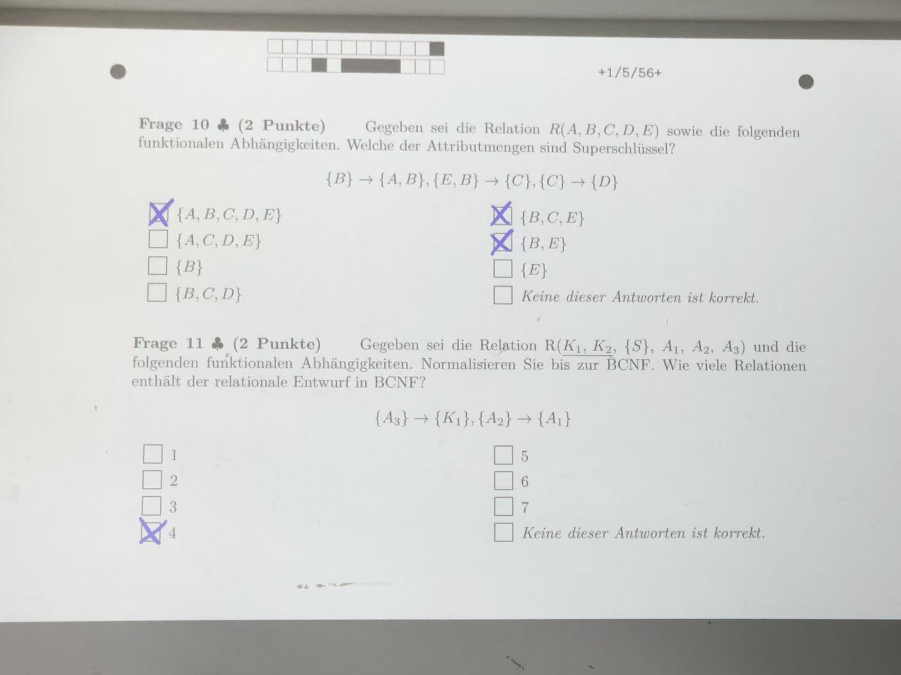

https://docs.freitagsrunde.org/Klausuren/Informationssysteme_und_Datenanalyse/Test_ISDA-20190719.cleaned.pdf

# 1 Entity-Relationship-Modellierung#

m Rahmen eines Forschungsprojektes soll ein Sensornetzwerk in einer Datenbank abgebildet wer-
den. Eine Messstation mit eindeutiger ID, lat und lon besteht dabei immer aus verschiedenen
Sensoren, welche nicht mit einer Messsattion verbunden sein müssen. Alle Sensoren besitzen eine
eindeutige ID sowie eine MAC-Adresse, ein Gewicht kann zusätzlich auch gespeichert werden. Sen-
soren sind immer vom Typ „Temperatur“, „NOX“, „PM10“ oder „Hydro“, es können dabei auch
die Mischformen „NOX“ und „PM10“ bzw. „Temperatur“ und „Hydro“ auftreten.

在一个研究项目的框架下，一个传感器网络需要在数据库中建模。一个测量站（Messstation）具有唯一的ID、纬度（lat）和经度（lon），并且总是由多个不同的传感器组成，但这些传感器不一定必须与某个测量站连接。每个传感器都有一个唯一的ID以及一个MAC地址，另外也可以存储一个重量（Gewicht）。传感器的类型始终是“温度”（Temperatur）、“氮氧化物”（NOX）、“可吸入颗粒物PM10”或“水文”（Hydro），也可能出现混合类型，如“NOX与PM10”或“温度与水文”。

1 是对的 

Abbildung 3 错的 
Schwarze Pubkte: bedeuten , jeden sensot muss zu eine Messation zugeordnet, aber in Aufgabestellung nicht so definiert 

Abbildung 2 对的
Raute: aggieration:  messatation besteht aus sensor .   
Schwarze Pubkte: in aggieration beziehung schwarz punkte bedeutet  eine messatation muss zumindest aus eine Sensor bestehen  
Aggregation = besteht aus (1:n oder 1:1 )

---

Temperatursensoren besitzen darüber hinaus noch eine Basiseinheit, während NOX-Sensoren
einen Fahrzeugzähler besitzen können. PM10-Sensoren sind auf eine bestimmte Weise hergestellt
worden und dürfen auf Grund von möglicherweise enthaltenen Gefahrenstoffen teilweise nur von
speziell ausgebildetem Personal gewartet werden. Hydro-Sensoren können nur in bestimmten Wer- tebereichen operieren. 

Darüber hinaus können Sensoren einen Hersteller haben, der sich über einen
Namen sowie eine Postleitzahl identifizieren lassen und außerdem eine Bilanz-URL besitzen.

温度传感器（Temperatursensoren）此外还具有一个基本单位（Basiseinheit），而NOX传感器可以拥有一个车辆计数器（Fahrzeugzähler）。PM10传感器是以特定方式制造的，由于可能包含有害物质，它们的维护部分只能由经过专门培训的人员进行。Hydro（水文）传感器只能在特定的数值范围内工作。此外，传感器可以有一个制造商（Hersteller），该制造商通过名称和邮政编码（Postleitzahl）进行标识，还可以拥有一个财务报表链接（Bilanz-URL）。

这个图是对的 

(t,o)
total:  eine sensor muss ein von alle aus mehere unterseneor bestehen
overlapping: eine sensor darf aus mehere unterseneor bestehen

- **总特化 Total**：因为每个 Sensor 都必须属于某种类型（Temperatur、NOX、PM10、Hydro 或它们的组合）。
    
- **重叠 Overlapping**：因为允许出现混合类型的传感器，如 “NOX 和 PM10” 或 “Temperatur 和 Hydro”。
---

在 **Entity-Relationship (ER) 模型** 中，**total** 和 **overlapping** 是在建模**子类-父类（Supertype-Subtype）结构**时用于描述**泛化/特化（generalization/specialization）关系**的重要概念。

**Total vs. Partial Specialization（总 vs. 部分 特化）**

用于描述：**每个父类实体是否必须属于某个子类。**

**Total Specialization（总特化）**
- 每个父类实体**必须是某个子类的实例**。
- 例如：如果你有一个实体 `Sensor`，并规定 **每个 Sensor 都必须是 Temperatur、NOX、PM10 或 Hydro 之一（或组合）**，这就是 **total**。
- ER 图中表示方法：在连接父类和子类的弧线下画一个 **双线**。

**Partial Specialization（部分特化）**
- 并**不是每个父类实体都属于某个子类**。
- 表示：父类实体可以没有任何子类归属。
- ER 图中表示方法：连接弧线下画一个 **单线**。

---

**Overlapping vs. Disjoint（重叠 vs. 不相交）**

用于描述：**一个父类实体是否可以属于多个子类。**

**Overlapping（重叠）**
- 一个实体**可以属于多个子类**。
- 例如：一个 Sensor 可能同时是 `NOX` 和 `PM10` 类型。
- ER 图中表示方法：在子类弧线旁边标注 **"o"（或 overlapping）**。

 **Disjoint（不相交）**
- 一个实体**只能属于一个子类**。
- 例如：如果每个 Sensor 要么是 Temperatur，要么是 Hydro，不可以同时是两者，那么这是 **disjoint**。
- ER 图中表示方法：在子类弧线旁边标注 **"d"（或 disjoint）**

---

Darüber hinaus können Sensoren einen Hersteller haben, der sich über einen
Namen sowie eine Postleitzahl identifizieren lassen und außerdem eine Bilanz-URL besitzen.

Anwser:  ist abgebildet 

- plz ist scharz punkte 因为 Hersteller identifizieren
- jedem Setller  mus 1 hersteller habe 
- 1 hersteller kann n senor haben
- keine Totalität (就是没有小黑点 在 raute 的左侧), sensoren muessen keine Herstellen haben 

---

Es existieren weiterhin Messzyklen mit einer eindeutigen Nummer sowie einer Mittelwertfunktion. 
Beliebig viele Messzyklen können aufeinander folgen. Messwerte müssen Teil eines solchen Messzyklus sein. 

Sie werden durch ein Konfidenzintervall, bestehend aus Start- und Endzeitpunkt identifiziert. Zusätzlich wird auch ein zufälliger Name gesetzt. 
Mehrere Messwerte können mit beliebig vielen Sensoren in Verbindung stehen, jeder Beziehung ist ein Zeitstempel zugeordnet.

此外，还存在具有唯一编号和一个均值函数（Mittelwertfunktion）的测量周期（Messzyklen）。任意数量的测量周期可以依次进行。测量值（Messwerte）必须属于某个这样的测量周期。每个测量值通过一个置信区间（Konfidenzintervall）进行标识，该区间由开始时间和结束时间组成。此外，还会为每个测量值设置一个随机名称。多个测量值可以与任意数量的传感器相关联，每个关联关系都带有一个时间戳。

Frage 5
Messwerte müssen Teil eines solchen Messzyklus  oder Sensor sein. , 不是 messatation, 所以 第一个 nicht abgebildet 

Frage 6 
ist abgebildet 

Frage 7  
ist abgebildet 
Mehrere Messwerte können mit beliebig vielen Sensoren in Verbindung stehen, jeder Beziehung ist ein Zeitstempel zugeordnet.  所以 kadinalitaet mn 是对的 

---

# 2 Das Relationale Modell

1 n 关系    schlussel steht immer am n Seite 

第二个 
是对的 
eingetrage_auf 的 promair schluseel 为 kennzeichen, 因为 1 个 frazuege  可以 只能 zu 1 Fahrer zugeordenet  

第四个 
datum 如果放在 FAHRzeug 中 就是正确的 
一个 fahrzeug  

第五个 
nur korrekt, 问您datum NULL sein  

----

gegeben sei ein EER Diagram mit einer Generalisierung/Spezialisierungsbeziehung zwischen einem generellen Entitytypen und 5 spezialisierten Typen. Die Beziehung
ist überlappend und total. Wie viele Relationen werden zur Abbildung im objektorientierten Stil benötigt?

给定一个扩展实体-关系（EER）图，其中存在一个**泛化/特化关系**，连接一个**通用实体类型**和 **5 个专门化类型**。该关系是**重叠的（overlapping）**且**全面的（total）**。  
在**面向对象风格的映射**中，需要多少个关系（表）来表示这个结构？

应该选 31  因为Die Beziehung
ist überlappend und total

---

# 3 Anfragesprachen

# 4 Data Stream Management 

h0(13) = 0, h1(13) = 2
h0(14) = 1, h1(14) = 4
h0(15) = 2, h1(15) = 6

0000000000  ->  1 1 1 0 1 0 1 0 0 0   , index 从 0开始 

对的是 
11 kommt nicht vor 
h0(11) = 3, h1(11) = 0

1 1 1 0 1 0 1 0 0 0  中 
0 的位置是1 
3 的位置是 0 

13 kommt moglichsweise  vor
h0(13) = 0, h1(13) = 2
1 1 1 0 1 0 1 0 0 0  中 
0 的位置是 1 
2 的位置是1 

43 kommt moglichsweise  vor
h0(43) = 0, h1(43) = 2
1 1 1 0 1 0 1 0 0 0  中 
0 的位置是 1 
2 的位置是1 

