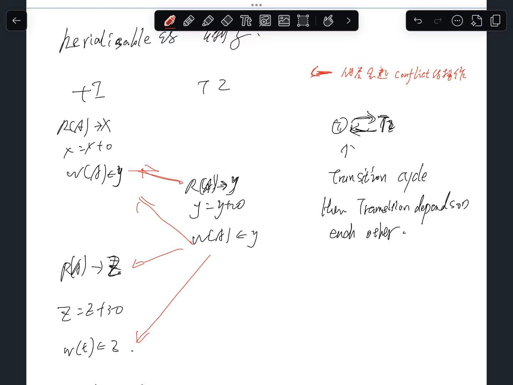

# 1 Concurrency Anomalien

Wie heißen die Anomalien, die im Mehrbenutzerbetrieb von relationalen Datenbanken bei mangelnder Isolation von Transaktionen auftreten können, wenn konkurrierende Zugriffe zeitgleich ausgeführt werden müssen?

• Transactions execute concurrently in the DBMS
    • Thus operations are interleaved
• Why?
    • Improve utilization of resources
    • Exploit multi-core using many threads, asynchronous IO, many disks
• Provide fairness to users
• Problem:
    • If two transactions use disjoint inputs => no problem
    • If two transactions share input => how to handle this?
    • Additionally: Long transactions have the potential of paralyze the system

----

Scenario: 
Gehen Sie bitte von nachfolgender Darstellung aus, die 2 Transaktionen zeigt, die einen Wert für Stückmenge aktualisieren sollen: Transaktion 1 soll die Stückmenge um 4 reduzieren, Transaktion 2 soll die Stückmenge um 5 erhöhen. Der Ausgangswert der Stückmenge ist 10.

Was sind mögliche Ergebnisse in Bezug auf den Wert der Stückmenge, wenn beide Transaktionen TA1 und TA2 nicht voneinander isoliert abgelaufen sind?

Wenn die beiden Transaktionen **TA1** (Stückmenge um 4 reduzieren) und **TA2** (Stückmenge um 5 erhöhen) nicht isoliert ablaufen, können unterschiedliche Probleme auftreten, die zu inkorrekten Ergebnissen führen. Hier sind mögliche Ergebnisse und die entsprechenden Szenarien:

## 1.1 Dirty Read

R: read the value of a , write the value intp t 

Eine Transaktion liest einen Wert, der von einer anderen Transaktion noch nicht festgeschrieben wurde.

A **Dirty Read** occurs when one transaction reads data that has been written by another transaction, but the second transaction has not yet committed. If the second transaction rolls back, the data read by the first transaction becomes invalid or "dirty."

- **Ergebnis**:  
    TA2 liest den Zwischenwert von TA1, bevor TA1 abgeschlossen ist.
    - **Reihenfolge**:
        - TA1: `10 - 4 = 6` (Zwischenwert)
        - TA2 liest `6 + 5 = 11`.
    - Endwert: **11** (falsch, da TA1 möglicherweise zurückgerollt wird).

Scenario:
We have a table `Account` that stores balances for different customers.

Initial Data:
- Table: `Account`
    - `AccountID = 1, Balance = 1000`

Two transactions are working on the same data:
- **Transaction A (TA1)** wants to decrease the balance by 200.
- **Transaction B (TA2)** wants to increase the balance by 300.

---

Breakdown:
1. Transaction A (TA1) starts and reads the current balance for AccountID = 1 (which is 1000):
    1.  `SELECT Balance FROM Account WHERE AccountID = 1; -- Result: Balance = 1000`
2. **Transaction B** (TA2) starts and updates the balance by increasing it by `300`, but hasn't yet committed the change:
    1. `UPDATE Account SET Balance = 1300 WHERE AccountID = 1; -- The balance is now 1300, but TA2 has not yet committed.`
3. **Transaction A** (TA1), still running, reads the balance again after the update by **Transaction B**, but **TA1** has not seen the `commit` of **TA2**. It reads the **dirty value** (`1300`):
    1. `SELECT Balance FROM Account WHERE AccountID = 1; -- Result: Balance = 1300 (even though Transaction B has not committed yet) `
4. **Transaction B** (TA2) rolls back the transaction due to some issue or error:
    1. `ROLLBACK; -- The balance reverts to the original value of 1000.`
5. **Transaction A** (TA1) proceeds with its operation, assuming the balance is 1300, and decreases it by 200:
    1. `UPDATE Account SET Balance = 1100 WHERE AccountID = 1;`

---

What Happens:
- **Transaction A** (TA1) performs a **Dirty Read** by reading the balance value `1300` that was written by **Transaction B** (TA2) before **TA2** had committed.
- Since **Transaction B** rolled back, the **actual balance** is still `1000`, but **Transaction A** operates as if the balance is `1300`, leading to incorrect updates.

Final Result:
- **Endwert**: `1100` (which is incorrect because **Transaction A** worked with invalid data).

Key Problem:
- **Dirty Read** occurs because **Transaction A** reads uncommitted data from **Transaction B**, which later rolled back. The data that **Transaction A** relied on was not valid.

Solution:
To avoid **Dirty Reads**, the database should use the **Read Committed** isolation level or higher, which ensures that a transaction can only read data that has been committed by other transactions. This way, **Transaction A** would not have read the uncommitted `1300` value from **Transaction B**.

## 1.2 **Lost Update**

Eine Transaktion überschreibt das Update der anderen Transaktion.

In a **Lost Update** scenario, two transactions concurrently modify the same data, and the update made by one transaction is overwritten by the other transaction, causing one of the updates to be lost. This happens when the transactions read and modify the same value without proper isolation.

Ergebnis
Das Ergebnis einer Transaktion wird durch die andere Transaktion verloren.
- **Reihenfolge**:
    - TA1: `10 - 4 = 6` (wird geschrieben).
    - TA2: `10 + 5 = 15` (überschreibt 6).
- Endwert: **15** (falsch, da das Update von TA1 verloren geht).

Scenario
We have a table `Inventory` that stores the number of items in stock.

Initial Data:
- Table: `Inventory`
    - `ItemID = 1, Stock = 10`

Two transactions are trying to update the `Stock` value for `ItemID = 1`:
- **Transaction A (TA1)** wants to decrease the stock by 4.
- **Transaction B (TA2)** wants to increase the stock by 5.

Breakdown:
1. **Transaction A** (TA1) starts and reads the current stock value from the table (which is `10`):
    1. `SELECT Stock FROM Inventory WHERE ItemID = 1; -- Result: Stock = 10`
2. **Transaction B** (TA2) starts and also reads the current stock value from the table (which is still `10`):
    1. `SELECT Stock FROM Inventory WHERE ItemID = 1; -- Result: Stock = 10`
3. **Transaction A** (TA1) decreases the stock by 4 and updates the table with the new value `6`:
    1. `UPDATE Inventory SET Stock = 6 WHERE ItemID = 1;`
4. **Transaction B** (TA2) increases the stock by 5 and updates the table with the new value `15`:
    1. `UPDATE Inventory SET Stock = 15 WHERE ItemID = 1;`

----

What Happens:
- **Transaction A** (TA1) writes `6` to the `Stock` column after subtracting 4 from 10.
- **Transaction B** (TA2) writes `15` to the `Stock` column after adding 5 to 10.
- Since **Transaction B** writes its result last, the update from **Transaction A** is **lost**, and the final `Stock` value will be `15` instead of the correct value (`6` + `5` = `11`).

Final Result:
- **Endwert**: **15** (The result of TA1 is lost, and TA2's update overwrites it.)

Key Problem
- **Lost Update** occurs because **Transaction A**'s update is overwritten by **Transaction B**'s update. The update by TA1 (`6`) is lost because TA2 (`15`) was written later without considering the first update.

Solution
To prevent a **Lost Update**, the system should use proper **transaction isolation**. This can be achieved by using higher isolation levels like **Serializable** or **Repeatable Read**, which will prevent both transactions from reading and modifying the same data concurrently.

Alternatively, **optimistic concurrency control** can be used, where the system checks if the data was modified by another transaction before committing an update. If the data was changed, the transaction can be aborted or retried.

## 1.3 **Non-Repeatable Read**

A **Non-Repeatable Read** occurs when a transaction reads the same data multiple times, but the value has been changed by another transaction in between those reads. This creates an inconsistency where the same data is read twice with different results.

每次transcation 读取同一个参数的值不一样, 因为中途被改变了

Eine Transaktion liest einen Wert mehrfach, aber der Wert wurde zwischen den Lesevorgängen durch die andere Transaktion verändert.

- **Ergebnis**:  
    TA2 liest den ursprünglichen Wert `10` und addiert 5, während TA1 zwischenzeitlich den Wert verändert hat.
    - **Reihenfolge**:
        - TA2 liest `10`.
        - TA1: `10 - 4 = 6`.
        - TA2: `10 + 5 = 15`.
    - Endwert: **15** (falsch, da TA2 den ursprünglichen Wert statt den aktualisierten Wert verwendet).

--- 

Example of Non-Repeatable Read:

A Non-Repeatable Read occurs when a transaction reads the same data multiple times, but the value has been changed by another transaction in between those reads. This creates an inconsistency where the same data is read twice with different results.

 Scenario:
- **Transaction A** reads the value of `StockQuantity` from a product and starts processing.
- **Transaction B** updates the `StockQuantity` after Transaction A's first read but before Transaction A's second read.

Initial Data:
- `StockQuantity` = 10

Step-by-Step Breakdown:
1. **Transaction A** reads the value of `StockQuantity` (which is 10).
    - **Transaction A (Step 1)**:  
        Reads `StockQuantity = 10`.
2. **Transaction B** updates `StockQuantity` (adds 5).
    - **Transaction B (Update)**:  
        `StockQuantity` is updated from 10 to 15.
3. **Transaction A** reads the value of `StockQuantity` again (but it now reads 15, which is different from its first read).
    - **Transaction A (Step 2)**:  
        Reads `StockQuantity = 15`.

Problem:
- **Transaction A** performed two reads of `StockQuantity`, expecting it to remain the same between reads. However, the value of `StockQuantity` changed after the first read due to **Transaction B**.
- The data was inconsistent for **Transaction A**, which is the essence of a **Non-Repeatable Read**.

Possible Result:
- **Transaction A** initially saw `StockQuantity = 10` and expected that same value for its second read, but it now sees `StockQuantity = 15`. This inconsistency can lead to errors, as **Transaction A** was not able to "repeat" its read with the same result.

This problem can be avoided by using higher isolation levels, such as **Serializable** or **Repeatable Read**, which prevent the underlying data from being changed by other transactions during the execution of the transaction.

## 1.4 **Phantom Read**

Hier treten Phantom-Werte auf, wenn neue Zeilen hinzugefügt oder gelöscht werden. Dies betrifft aber in diesem Fall keine Zeilenoperationen, daher ist **Phantom Read** nicht relevant.

A **Phantom Read** occurs when a transaction reads a set of rows that match a certain condition, but another transaction concurrently inserts, deletes, or updates rows that cause the result set of the first transaction to change unexpectedly before it completes.

---

Scenario:
- **Transaction A** performs a query to count how many products have a `Price` greater than 100.
- **Transaction B** concurrently inserts new products with a `Price` greater than 100, affecting the result of **Transaction A**'s query.

Initial Data:
- Product table:
    - `ProductID: 1, Price: 50`
    - `ProductID: 2, Price: 120`
    - `ProductID: 3, Price: 80`

Step-by-Step Breakdown:
1. **Transaction A** starts and executes the following query:
    1. `SELECT COUNT(*) FROM Products WHERE Price > 100;
    2. **Transaction A (Step 1)**:   The result set at this point contains only one product with `Price = 120` (i.e., Product 2). Therefore, the query returns `1`.
2. **Transaction B** concurrently inserts a new product with `Price = 150`:
    1. **Transaction B (Insert)**: `INSERT INTO Products (ProductID, Price) VALUES (4, 150);`
3. **Transaction A** executes the same query again, expecting the same result as the first time, but now the result set includes the new product inserted by **Transaction B**.
    1. **Transaction A (Step 2)**: The query now returns `2` because the newly inserted product (Product 4) also has a `Price > 100`.

---

Problem:
- **Transaction A**'s query initially returned `1` but later returned `2`, even though the same condition (`Price > 100`) was applied both times.
- The data has changed in between the two queries due to **Transaction B**'s insert, causing a **Phantom Read**.

Result:
- **Transaction A** sees inconsistent results because the set of rows that match its query criteria has changed between its reads. The appearance of new rows (the "phantoms") is the essence of a **Phantom Read**.

Solution:
- **Phantom Reads** can be avoided by using higher isolation levels such as **Serializable**, which locks the range of data being queried and prevents new rows from being added or removed during the transaction.

## 1.5 The Interleaving Problem

Interleaved execution of transactions may cause inconsistencies
• Which interleaved executions should be allowed?

serial Execution: t1先, 在t2
interleaved Execution: t1 pause, t2. t1 

# 2 Transaction Model

• We need to identify important properties of transactions in order to reason about concurrency
• Transactions work on database elements X, Y, … (it could be relations, pages, tuples, …)
• Only two core operations
    • Read operation: R(X), R(Y), ...
    • Write operation: W(X), W(Y), …
• Other operations do not matter
    • Impossible to reason about computation
    • But we can reason about the order of read and writes
• A transaction T is a sequence of read and write operations on any kind of database element
    • We identify multiple transactions by their number: T1 = R1(X), W1(Y), R1(Z)

# 3 Schedules

• A schedule is a sequence (arrangement) of operations from multiple transactions T1, ..., Tn
• The sequence is orchestrated to prevent conflicts and ensure proper timing of transaction
• Example: Tx1= R1(A), W1(A), Tx2= R2(A), W2(A)
    • S = R1(A), R2(A), W1(A), W2(A)
    • The lost update problem from before: W1(A) is lost
• Must contain all the read and write operations
    • Not a valid schedule of TX1 and TX2 if for example:
        • R1(A), R2(A), W2(A)
• For each TX, the operations must be in the original order
    • Not a valid schedule of TX1 and TX2 if for example:
        • W1(A), R1(A), R2(A), W2(A)
• Some schedules are fine with respect to concurrency (no interleaving):
    • S1 = R1(A), W1(A), R2(A), W2(A)
    • S2 = R2(A), W2(A), R1(A), W1(A)

Serial Schedules
• Simple solution: serialize all transactions
• A schedule is serial if operations from different TX are not interleaved
    • i.e., Each TX finishes its operations before the operations of another TX start
• Serial schedules have no concurrency issues (because there is none)
    • But how low throughput
• For n transactions, there are n! different serial schedules
    • The final state of the DB must not be the same for all the serial schedules!
    • Concurrency management does not care about internal operations, only about interleaving of read and write operations
• Can be abbreviated as a sequence of transactions
    • S1: T1, T2
    • S2: T2, T1

Serial schedules with different results

# 4 Serializability

> serializability: transformation is equivalent as runs serialisable change order of transation
> Serializable only check outcomes. it check the result to leave 

• Better idea: Exploit concurrency if possible
• Serializable means that concurrency has added no effect
• A schedule for a set of TX T is called serializable if its result is equal to the result of a serial schedule of T
• Interleaving is okay, as long as the same result could be achieved without interleaving
    • Not serializable: S = R1(A), R2(A), W1(A), W2(A)
    • If both TX add 100 to an account initially in 0, the result must be + 200

## 4.1 Conflicts
• A conflict is a pair of operations in a schedule that if their order is changed, the behavior of at least one TX changes
• Non-conflicting operations: When two operations operate on separate data items or the same data item non is a write operation, they are said to be nonconflicting.
• Two operations are said to be conflicting if all conditions are satisfied:
    • C1: They belong to different transactions
    • C2: They operate on the same data item
    • C3: At Least one of them is a write operation
• Examples for conflicts:
    • (R1(A), W2(A)) conflict because they belong to two different transactions on the same data item A and one of them is a write operation. (C1,C2,C3)
    • (W1(A), W2(A)) and (W1(A), R2(A)) pairs are also conflicting. (C1,C2,C3)
• Examples for non-conflicts:
    • (R1(A), W2(B)) => (C2) / ((W1(A), W2(B)) => (C2)
    • R1(A), R2(A) => (C3) / (R1(A), W1(A)) => (C1)

会引起 conflict 的operations
1. seperate transcation
2. on the same db object 
3. at least one of them is write operation 

---

When and how can two operations cause a conflict?

## 4.2 Conflict-Serializable Schedules
• Conflict Equivalence: Conflict equivalence is a type of transaction equivalence in DBMS. Two schedules are conflict equivalent if the order of any two conflicting operations, initially in the same transaction, is maintained in both schedules. Conflicting operations are those operations having the same data item where at least one operation is a write operation.
• Two schedules S1 and S2 are conflict-equivalent if
    • They are defined on the same set of TX
    • We can turn one into the other by a sequence of swaps of non-conflicting adjacent operations
• A schedule is conflict-serializable if a conflict-equivalent serial schedule exists
    • All conflicting operations must be executed in the same order in the serial schedule
    • The order of the remaining operations does not matter
    • Result: Schedule is free of concurrency-related issues like dirty reads, nonrepeatable reads, and phantom reads.

why conflicet serializability is better serialzability: 
serializability 难设计, conflicet serializability 给我们指引了方向 如何去设计 transation serialisation ( reorder the read and write operation )

## 4.3 Example
‣ Initial Schedule:
    ‣ S1: R1(A), W1(A), R2(A), W2(A), R1(B), W1(B), R2(B), W2(B)
‣ Consists of two transactions:
    ‣ T1: R1(A), W1(A), R1(B), W1(B)
    ‣ T2: R2(A), W2(A), R2(B), W2(B)
‣ Possible Serial Schedules are: T1->T2 or T2->T1
‣ Swapping non-conflicting operations R2(A) and R1(B) in S1, the schedule becomes:
    ‣ S11: R1(A), W1(A), R1(B), W2(A), R2(A), W1(B), R2(B), W2(B)
‣ Similarly, swapping non-conflicting operations W2(A) and W1(B) in S11, the schedule becomes
    ‣ S12: R1(A), W1(A), R1(B), W1(B), R2(A), W2(A), R2(B), W2(B)
‣ S12 is a serial schedule T1 -> T2, since S1 has been transformed into S12 by swapping non-conflicting operations of S1, S1 is conflict serializable.

## 4.4 Advantages of Conflict Serializability
‣ Consistency: Conflict serializability guarantees that the transactions’ outcomes correspond to the sequence in which they were carried out
‣ Correctness: Regardless of the order in which transactions were submitted, conflict serializability guarantees that transactions are executed correctly
‣ Enhanced Concurrency: By enabling concurrent execution of operations without causing conflicts, conflict serializability enhances concurrency

Disadvantages of Conflict Serializability
‣ Complexity: Conflict serializability can be complex to implement, especially in large and complex databases
‣ Limited Concurrency: Conflict serializability can limit the degree of concurrency in the system because it may delay some transactions to avoid conflict
‣ Increased Overhead: Conflict serializability requires additional overhead to maintain the order of the transactions and ensure that they do not conflict with each other

# 5 Precedence Graph

‣ A Precedence Graph or Serialization Graph is used commonly to test the Conflict Serializability of a schedule
‣ It is a directed Graph (V, E) consisting of a set of nodes V = {T1, T2, T3……….Tn} (representing transactions) and a set of directed edges E = {e1, e2, e3……………… em}.
‣ The graph contains one node for each Transaction Ti.
‣ An edge ei is of the form Tj –> Tk where Tj is the starting node of ei and Tk is the ending node of ei
‣ An edge ei is constructed between nodes Tj to Tk if one of the operations in Tj appears in the schedule before some conflicting operation in Tk.

example

Detailed Algorithm
• Given a schedule S involving TX T1 and T2, the transaction T1 takes precedence over T2 (T1 < T2) if and only if
    • There are conflicting operations O1 from T1 and O2 from T2
    • O1 appears before O2 in the schedule
• Algorithm:
    • Create a node T in the graph for each participating transaction in the schedule.
    • For the conflicting operation read_item(X) and write_item(X) – If a Transaction Tj executes a read_item (X) after Ti executes a write_item (X), draw an edge from Ti to Tj in the graph.
    • For the conflicting operation write_item(X) and read_item(X) – If a Transaction Tj executes a write_item (X) after Ti executes a read_item (X), draw an edge from Ti to Tj in the graph.
    • For the conflicting operation write_item(X) and write_item(X) – If a Transaction Tj executes a write_item (X) after Ti executes a write_item (X), draw an edge from Ti to Tj in the graph.

Conflict-serializable
• A schedule is conflict-serializable iff its precedence graph is cycle-free
• Intuition:
    • If two operations are in conflict, we need to preserve their order in a conflictequivalent serial schedule
    • Each conflict puts a constraint on the possible orders
    • If the precedence graph contains a cycle, no orders can be fulfilled
• Any topological order of the precedence graph is a conflict-equivalent serial schedule

# 6 More Properties of Schedules

• Recoverable Schedules (RC):
    • Allows for the recovery of the database to a consistent state after a transaction failure
    • A Tx can only read committed data of other Tx, i.e., commit of the write transaction Tj must be carried out before the commit of the read transaction Ti.
    • If Tx fail before commit => rollback any Tx that read the data
• Avoids cascading resets (ACA) also called Cascadeless
    • It does not lead to cascading rollbacks if a Tx fails
    • Delay reading TxR of uncommitted data until writing TxW committed and thus TxR does not need to be rolled back
• Strict schedule (ST):
    • A strict schedule is a schedule in which the order of transactions is preserved exactly as specified by the program or user (it is RC and ACA)

Relationships Between Schedules

