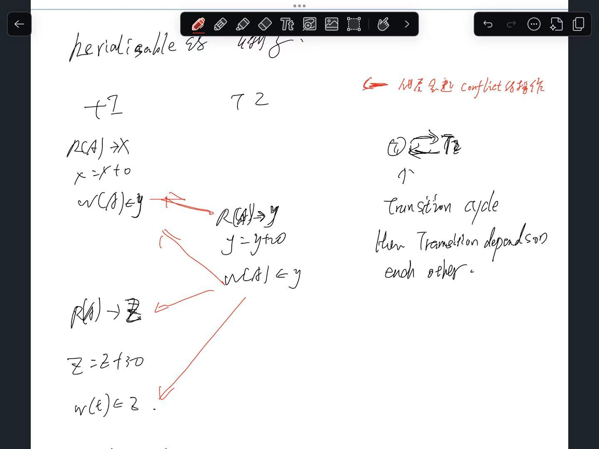

# 1 Concurrency Anomalien

Wie heißen die Anomalien, die im Mehrbenutzerbetrieb von relationalen Datenbanken bei mangelnder Isolation von Transaktionen auftreten können, wenn konkurrierende Zugriffe zeitgleich ausgeführt werden müssen?

• Transactions execute concurrently in the DBMS
    • Thus operations are interleaved
• Why?
    • Improve utilization of resources
    • Exploit multi-core using many threads, asynchronous IO, many disks
• Provide fairness to users
• Problem:
    • If two transactions use disjoint inputs => no problem
    • If two transactions share input => how to handle this?
    • Additionally: Long transactions have the potential of paralyze the system

----

Scenario: 
Gehen Sie bitte von nachfolgender Darstellung aus, die 2 Transaktionen zeigt, die einen Wert für Stückmenge aktualisieren sollen: Transaktion 1 soll die Stückmenge um 4 reduzieren, Transaktion 2 soll die Stückmenge um 5 erhöhen. Der Ausgangswert der Stückmenge ist 10.

Was sind mögliche Ergebnisse in Bezug auf den Wert der Stückmenge, wenn beide Transaktionen TA1 und TA2 nicht voneinander isoliert abgelaufen sind?

Wenn die beiden Transaktionen **TA1** (Stückmenge um 4 reduzieren) und **TA2** (Stückmenge um 5 erhöhen) nicht isoliert ablaufen, können unterschiedliche Probleme auftreten, die zu inkorrekten Ergebnissen führen. Hier sind mögliche Ergebnisse und die entsprechenden Szenarien:

---

关于 linterleaving problem, lost update , dirty read, Non-repeatable Read, Phantom Read, 见 [200_11_05_Concurrency Control_Lecture_IsolationLevels](200_11_05_Concurrency%20Control_Lecture_IsolationLevels.md)

# 2 Transaction Model

• We need to identify important properties of transactions in order to reason about concurrency
• Transactions work on database elements X, Y, … (it could be relations, pages, tuples, …)
• Only two core operations
    • Read operation: R(X), R(Y), ...
    • Write operation: W(X), W(Y), …
• Other operations do not matter
    • Impossible to reason about computation
    • But we can reason about the order of read and writes
• A transaction T is a sequence of read and write operations on any kind of database element
    • We identify multiple transactions by their number: T1 = R1(X), W1(Y), R1(Z)

# 3 Schedules

• A schedule is a sequence (arrangement) of operations from multiple transactions T1, ..., Tn
• The sequence is orchestrated to prevent conflicts and ensure proper timing of transaction
• Example: Tx1= R1(A), W1(A), Tx2= R2(A), W2(A)
    • S = R1(A), R2(A), W1(A), W2(A)
    • The lost update problem from before: W1(A) is lost
• Must contain all the read and write operations
    • Not a valid schedule of TX1 and TX2 if for example:
        • R1(A), R2(A), W2(A)
• For each TX, the operations must be in the original order
    • Not a valid schedule of TX1 and TX2 if for example:
        • W1(A), R1(A), R2(A), W2(A)
• Some schedules are fine with respect to concurrency (no interleaving):
    • S1 = R1(A), W1(A), R2(A), W2(A)
    • S2 = R2(A), W2(A), R1(A), W1(A)

Serial Schedules
• Simple solution: serialize all transactions
• A schedule is serial if operations from different TX are not interleaved （finishe trancation A, then Transcation B, then C ）
    • i.e., Each TX finishes its operations before the operations of another TX start
• Serial schedules have no concurrency issues (because there is none)
    • But how low throughput
• For n transactions, there are n! different serial schedules
    • The final state of the DB must not be the same for all the serial schedules!
    • Concurrency management does not care about internal operations, only about interleaving of read and write operations
• Can be abbreviated as a sequence of transactions
    • S1: T1, T2
    • S2: T2, T1

Serial schedules with different results

# 4 Serializability

> Even serializable schedules may cause an inconsistent database state from an application's point of view if no integrity constraint is defined. - **可串行化（Serializable）** 只保证事务的并发执行**等价于某个串行顺序**，它确保数据库在事务结束时保持**内部一致性**（即满足所有已定义的完整性约束）。

> serializability: transformation is equivalent as runs serialisable change order of transation
> Serializable only check outcomes. it check the result to leave 

• Better idea: Exploit concurrency if possible
• ==Serializable means that concurrency has added no effect==
• A schedule for a set of TX T is called serializable if its result is equal to the result of a serial schedule of T
• Interleaving is okay, as long as the same result could be achieved without interleaving
    • Not serializable: S = R1(A), R2(A), W1(A), W2(A)
    • If both TX add 100 to an account initially in 0, the result must be + 200

## 4.1 Conflicts
• A conflict is a pair of operations in a schedule that if their order is changed, the behavior of at least one TX changes
• Non-conflicting operations: When two operations operate on separate data items or the same data item non is a write operation, they are said to be nonconflicting.
• Two operations are said to be conflicting if all conditions are satisfied:
    • C1: They belong to different transactions
    • C2: They operate on the same data item
    • C3: At Least one of them is a write operation
• Examples for conflicts:
    • (R1(A), W2(A)) conflict because they belong to two different transactions on the same data item A and one of them is a write operation. (C1,C2,C3)
    • (W1(A), W2(A)) and (W1(A), R2(A)) pairs are also conflicting. (C1,C2,C3)
• Examples for non-conflicts:
    • (R1(A), W2(B)) => (C2) / ((W1(A), W2(B)) => (C2)
    • R1(A), R2(A) => (C3) / (R1(A), W1(A)) => (C1)

会引起 conflict 的operations
1. seperate transcation
2. on the same db object 
3. at least one of them is write operation 

---

When and how can two operations cause a conflict?

## 4.2 Conflict-Serializable Schedules 冲突可串行化调度
• Conflict Equivalence: Conflict equivalence is a type of transaction equivalence in DBMS. Two schedules are conflict equivalent if the order of any two conflicting operations, initially in the same transaction, is maintained in both schedules. Conflicting operations are those operations having the same data item where at least one operation is a write operation.
• Two schedules S1 and S2 are conflict-equivalent if
    • They are defined on the same set of TX
    • We can turn one into the other by a sequence of swaps of non-conflicting adjacent operations
• > A schedule is conflict-serializable if a conflict-equivalent serial schedule exists
    • All conflicting operations must be executed in the same order in the serial schedule
    • The order of the remaining operations does not matter
    • Result: Schedule is free of concurrency-related issues like dirty reads, nonrepeatable reads, and phantom reads.

why conflicet serializability is better serialzability: 
serializability 难设计, conflicet serializability 给我们指引了方向 如何去设计 transation serialisation ( reorder the read and write operation )

### 4.2.1 冲突等价 Conflict Equivalence

- 两个调度 S1 和 S2 是**冲突等价**的，当且仅当：
    - 它们基于同一组事务定义        
    - 我们可以通过一系列**非冲突相邻操作的交换**将其中一个调度转换为另一个

- **冲突等价**：冲突等价是数据库管理系统中一种事务等价类型。如果两个调度中**任意两个冲突操作的顺序**（这两个操作最初属于同一事务）在两个调度中都保持不变，则这两个调度是冲突等价的。冲突操作是指作用于同一数据项且至少有一个是写操作的成对操作。

两个调度 S1 和 S2 是冲突等价的，当且仅当：
1. 它们包含**相同的事务集合**。
2. 对于任意一对**冲突的操作**，它们在 S1 和 S2 中的**先后顺序相同**。

**什么是“冲突操作”？**
两个操作属于不同事务、访问同一个数据项，并且**至少有一个是写操作**时，它们就是冲突的。

**三种冲突类型**：
1. **读-写冲突**：Rᵢ(X) 和 Wⱼ(X)（i ≠ j）
    - 顺序改变会影响读取的值。
2. **写-读冲突**：Wᵢ(X) 和 Rⱼ(X)（i ≠ j）
    - 顺序改变会影响读取的值。
3. **写-写冲突**：Wᵢ(X) 和 Wⱼ(X)（i ≠ j）
    - 顺序改变会影响数据的最终值。

**注意**：读-读操作（Rᵢ(X) 和 Rⱼ(X)）**不冲突**，因为无论顺序如何，读取的值都一样。

---

为什么通过交换非冲突相邻操作可以实现转换？
- **相邻操作**：在调度中紧挨着的两个操作。
- **非冲突操作**：可以安全交换顺序而不影响最终结果的操作（例如读-读，或访问不同数据项的操作）。
- 如果我们能通过一系列这样的交换将 S1 转换成 S2，那么它们就是冲突等价的。

**例**：  
调度：R₁(A) R₂(A) W₁(A)  
R₁(A) 和 R₂(A) 是读-读，可以交换顺序。  
交换后：R₂(A) R₁(A) W₁(A)  
这两个调度是冲突等价的。

## 4.3 冲突可串行化 Conflict-serializable

- 一个调度是**冲突可串行化**的，如果存在一个与它冲突等价的串行调度
    - 所有冲突操作在串行调度中必须以相同的顺序执行
    - 其余操作的顺序无关紧要
    - 结果：该调度不会出现脏读、不可重复读和幻读等并发相关问题
- 

如果一个调度 S 与**某个串行调度**冲突等价，则称 S 是冲突可串行化的。

**串行调度**：事务一个接一个地执行，没有交错。

**如何判断？**

1. **构建优先图（Precedence Graph）**：
    - 每个事务是一个节点。
    - 如果 Tᵢ 的某个操作与 Tⱼ 的某个操作冲突，并且在调度中 Tᵢ 的操作在前，则画一条边 Tᵢ → Tⱼ。
2. **检查环**：
    - 如果图中**没有环**，则该调度是冲突可串行化的。
    - 如果图中有环，则不是冲突可串行化。

## 4.4 Example
‣ Initial Schedule:
    ‣ S1: R1(A), W1(A), R2(A), W2(A), R1(B), W1(B), R2(B), W2(B)
‣ Consists of two transactions:
    ‣ T1: R1(A), W1(A), R1(B), W1(B)
    ‣ T2: R2(A), W2(A), R2(B), W2(B)
‣ Possible Serial Schedules are: T1->T2 or T2->T1
‣ Swapping non-conflicting operations R2(A) and R1(B) in S1, the schedule becomes:
    ‣ S11: R1(A), W1(A), R1(B), W2(A), R2(A), W1(B), R2(B), W2(B)
‣ Similarly, swapping non-conflicting operations W2(A) and W1(B) in S11, the schedule becomes
    ‣ S12: R1(A), W1(A), R1(B), W1(B), R2(A), W2(A), R2(B), W2(B)
‣ S12 is a serial schedule T1 -> T2, since S1 has been transformed into S12 by swapping non-conflicting operations of S1, S1 is conflict serializable.

## 4.5 Advantages of Conflict Serializability
‣ Consistency: Conflict serializability guarantees that the transactions’ outcomes correspond to the sequence in which they were carried out
‣ Correctness: Regardless of the order in which transactions were submitted, conflict serializability guarantees that transactions are executed correctly
‣ Enhanced Concurrency: By enabling concurrent execution of operations without causing conflicts, conflict serializability enhances concurrency

**冲突可串行化的优势**

- **一致性**：冲突可串行化保证了事务执行的结果与按照某种串行顺序执行的结果一致
    
- **正确性**：无论事务提交的顺序如何，冲突可串行化都能确保事务正确执行
    
- **更高的并发性**：通过允许无冲突的操作并发执行，冲突可串行化提高了系统的并发处理能力

## 4.6 Disadvantages of Conflict Serializability
‣ Complexity: Conflict serializability can be complex to implement, especially in large and complex databases
‣ Limited Concurrency: Conflict serializability can limit the degree of concurrency in the system because it may delay some transactions to avoid conflict
‣ Increased Overhead: Conflict serializability requires additional overhead to maintain the order of the transactions and ensure that they do not conflict with each other

- **复杂性**：冲突可串行化的实现可能很复杂，尤其是在大型复杂数据库中
    
- **有限的并发度**：冲突可串行化可能限制系统的并发程度，因为它可能需要延迟某些事务以避免冲突
    
- **额外开销增加**：冲突可串行化需要额外的开销来维护事务的顺序，并确保它们彼此之间不发生冲突

# 5 Precedence Graph

> **冲突可串行化 ⇔ 优先图中无环**. 如果图中有环，则该调度不是冲突可串行化的。

‣ A Precedence Graph or Serialization Graph is used commonly to test the Conflict Serializability of a schedule
‣ It is a directed Graph (V, E) consisting of a set of nodes V = {T1, T2, T3……….Tn} (representing transactions) and a set of directed edges E = {e1, e2, e3……………… em}.
‣ The graph contains one node for each Transaction Ti.
‣ An edge ei is of the form Tj –> Tk where Tj is the starting node of ei and Tk is the ending node of ei
‣ An edge ei is constructed between nodes Tj to Tk if one of the operations in Tj appears in the schedule before some conflicting operation in Tk.

**前驱图（优先图）或串行化图**通常用于测试调度是否满足冲突可串行化。

- 它是一个有向图 (V, E)，其中：
    
    - 顶点集 V = {T₁, T₂, T₃, …, Tₙ}，每个顶点代表一个事务
        
    - 边集 E = {e₁, e₂, e₃, …, eₘ}，每条边是有向边
        
- 图中的每个事务 Tᵢ 对应一个顶点。
    
- 一条边 eᵢ 的形式为 Tⱼ → Tₖ，其中 Tⱼ 是 eᵢ 的起点，Tₖ 是 eᵢ 的终点。
    
- 如果在调度中，事务 Tⱼ 的某个操作出现在事务 Tₖ 的某个冲突操作之前，则在 Tⱼ 到 Tₖ 之间建立一条有向边。

example

Detailed Algorithm
• Given a schedule S involving TX T1 and T2, the transaction T1 takes precedence over T2 (T1 < T2) if and only if
    • There are conflicting operations O1 from T1 and O2 from T2
    • O1 appears before O2 in the schedule
• Algorithm:
    • Create a node T in the graph for each participating transaction in the schedule.
    • For the conflicting operation read_item(X) and write_item(X) – If a Transaction Tj executes a read_item (X) after Ti executes a write_item (X), draw an edge from Ti to Tj in the graph.
    • For the conflicting operation write_item(X) and read_item(X) – If a Transaction Tj executes a write_item (X) after Ti executes a read_item (X), draw an edge from Ti to Tj in the graph.
    • For the conflicting operation write_item(X) and write_item(X) – If a Transaction Tj executes a write_item (X) after Ti executes a write_item (X), draw an edge from Ti to Tj in the graph.

- 给定一个涉及事务 T₁ 和 T₂ 的调度 S，当且仅当满足以下条件时，称 **T₁ 优先于 T₂**（记作 T₁ < T₂）：
    
    - 存在来自 T₁ 的操作 O₁ 和来自 T₂ 的操作 O₂ 互相冲突
        
    - 在调度 S 中，O₁ 出现在 O₂ 之前

**算法步骤：**

1. **创建节点**：为调度中参与的每个事务 Tᵢ 在图中创建一个节点。
    
2. **处理冲突操作并添加边**：
    
    - **冲突情况 1**：`read_item(X)` 与 `write_item(X)`  
        如果事务 Tⱼ 在事务 Tᵢ 执行 `write_item(X)` 之后执行 `read_item(X)`，则在图中添加一条从 **Tᵢ 指向 Tⱼ** 的边。
        
    - **冲突情况 2**：`write_item(X)` 与 `read_item(X)`  
        如果事务 Tⱼ 在事务 Tᵢ 执行 `read_item(X)` 之后执行 `write_item(X)`，则在图中添加一条从 **Tᵢ 指向 Tⱼ** 的边。
        
    - **冲突情况 3**：`write_item(X)` 与 `write_item(X)`  
        如果事务 Tⱼ 在事务 Tᵢ 执行 `write_item(X)` 之后执行 `write_item(X)`，则在图中添加一条从 **Tᵢ 指向 Tⱼ** 的边。

这三种冲突情况覆盖了所有可能的读写冲突组合（`R-W`、`W-R`、`W-W`）。  
`R-R`（读-读）不属于冲突操作，不会产生优先边。  
构建好图后，如果图中**不存在环**，则该调度是**冲突可串行化的**，并且可以通过拓扑排序得到一个等价的串行调度顺序。

----

Conflict-serializable
• A schedule is conflict-serializable iff its precedence graph is cycle-free
• Intuition:
    • If two operations are in conflict, we need to preserve their order in a conflictequivalent serial schedule
    • Each conflict puts a constraint on the possible orders
    • If the precedence graph contains a cycle, no orders can be fulfilled
• Any topological order of the precedence graph is a conflict-equivalent serial schedule

**冲突可串行化**

- 一个调度是**冲突可串行化的**，当且仅当其前驱图（优先图）**无环**。
    
- **直观理解**：
    
    - 如果两个操作存在冲突，我们需要在一个冲突等价的串行调度中保留它们的执行顺序。
        
    - 每一个冲突都对事务的可能顺序施加了一个约束。
        
    - 如果前驱图中包含环，那么这些约束无法同时满足（即存在循环依赖）。
        
- 前驱图的**任一拓扑排序**都对应一个与该调度**冲突等价的串行调度**。

# 6 More Properties of Schedules

• Recoverable Schedules (RC):
    • Allows for the recovery of the database to a consistent state after a transaction failure
    • A Tx can only read committed data of other Tx, i.e., commit of the write transaction Tj must be carried out before the commit of the read transaction Ti.
    • If Tx fail before commit => rollback any Tx that read the data
• Avoids cascading resets (ACA) also called Cascadeless
    • It does not lead to cascading rollbacks if a Tx fails
    • Delay reading TxR of uncommitted data until writing TxW committed and thus TxR does not need to be rolled back
• Strict schedule (ST):
    • A strict schedule is a schedule in which the order of transactions is preserved exactly as specified by the program or user (it is RC and ACA)

**1. 可恢复调度（Recoverable Schedule，RC）**

- **作用**：允许在事务失败后将数据库恢复到一致性状态。
    
- **关键规则**：一个事务只能读取其他**已提交事务**的数据。  
    即：写事务 Tⱼ 必须在读事务 Tᵢ 提交之前提交。
    
- **恢复机制**：如果某个事务在提交前失败，系统必须回滚**所有读取了该事务数据**的其他事务。
    

---

**2. 避免级联回滚（Avoids Cascading Aborts，ACA / Cascadeless）**

- **目标**：防止因一个事务失败而导致多个事务连续回滚的“级联效应”。
    
- **实现方式**：延迟读取未提交数据，直到写事务提交。  
    即：如果事务 Tᵢ 要读取 Tⱼ 写入的数据，必须等到 Tⱼ **提交后**才能读取。
    
- **效果**：一个事务失败时，不会导致其他事务回滚（因为它们没有读取该事务的未提交数据）。
    

---

6.2 **3. 严格调度（Strict Schedule，ST）**

- **定义**：严格调度是一种事务顺序严格按照程序或用户指定顺序执行的调度。
    
- **性质**：严格调度**同时满足 RC 和 ACA**。
    
- **附加规则**：事务对数据项的写操作必须在**写入该数据项的事务提交之后**才能被其他事务读取或覆盖。
    
- **优势**：恢复简单，回滚时只需撤销本事务的写操作，无需检查其他事务的依赖。
    

---

## 6.1 **关系总结**

- **严格调度（ST）** ⊂ **避免级联回滚（ACA）** ⊂ **可恢复调度（RC）** ⊂ **所有调度**
    
- **安全性递增**：ST 是最安全的，RC 是最基本要求。

Relationships Between Schedules

