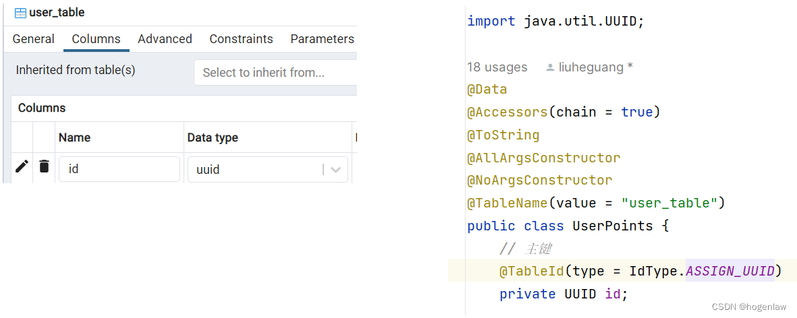
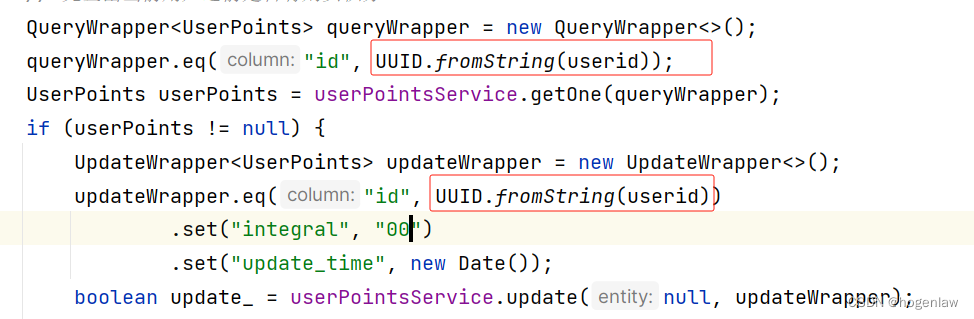

**注意，表名和表字段使用下划线方式命名，不要用驼峰，不然映射到Java 会报找不到表的错**


# 1 数据类型 


# 2 CHARACTER VARYING(255) or VARCHAR(255) 

CHARACTER VARYING(255) (or VARCHAR(255)) → A variable-length string with a maximum length of 255 characters.


## 2.1 BIGINT/`INTEGER`/`BIGINT`

| Type               | Storage Size | Range                                                       |
| ------------------ | ------------ | ----------------------------------------------------------- |
| `SMALLINT`         | 2 bytes      | `-32,768` to `32,767`                                       |
| `INTEGER` (`INT4`) | 4 bytes      | `-2,147,483,648` to `2,147,483,647`                         |
| `BIGINT` (`INT8`)  | 8 bytes      | `-9,223,372,036,854,775,808` to `9,223,372,036,854,775,807` |


不是的自增字段


```java
ALTER TABLE public.kss_user_pay 
    ALTER COLUMN myid 
    SET DATA TYPE BIGINT;  -- 确保数据类型正确

ALTER TABLE public.kss_user_pay 
    ALTER COLUMN myid 
    SET DEFAULT nextval('public.kss_user_pay_id_seq');
```


## 2.2 SMALLSERIAL/SERIAL/BIGSERIAL: (可以自增的数据类型)

2/4/6 Bytes 

PostgreSQL 提供 `SERIAL` 类型，它会自动创建 **序列** 并绑定到字段
- `BIGSERIAL` is an **auto-incrementing BIGINT** (hidden sequence).
- This is the **recommended** way to define an auto-incrementing `BIGINT` primary key.

```sql
CREATE TABLE users (
    id BIGSERIAL PRIMARY KEY,  -- Auto-incrementing BIGINT
    name VARCHAR(255)
);
```


## 2.3 UUID

UUID（Universally Unique Identifier） 是 128 位 的标识符，通常用来确保全局唯一性。
在 PostgreSQL 中，UUID 的默认格式为： `550e8400-e29b-41d4-a716-446655440000` （包含 **32 个十六进制字符 + 4 个 - ）

UUID 无法自增


---

直接使用 uuid 数据类型
```sql
CREATE TABLE users (
    id UUID DEFAULT gen_random_uuid() PRIMARY KEY,  -- 默认使用随机 UUID
    name VARCHAR(100) NOT NULL
);
```
- `DEFAULT gen_random_uuid()`：每次插入新行时，默认自动生成 **UUID**。
- `PRIMARY KEY`：用作 **主键**，确保唯一性。
> ✅ **`gen_random_uuid()`** 需要 `pgcrypto` 扩展，运行 `CREATE EXTENSION IF NOT EXISTS "pgcrypto";` 以启用。


---


插入数据
```sql
INSERT INTO users (name) VALUES ('Alice') RETURNING id;
-- 自动生成 UUID
```

---

**UUID 生成方式**

| 方式                   | 说明                    | 需要扩展        |
| -------------------- | --------------------- | ----------- |
| `gen_random_uuid()`  | 生成 **随机 UUID（推荐）**    | `pgcrypto`  |
| `uuid_generate_v4()` | 生成 **随机 UUID**（标准 V4） | `uuid-ossp` |
| `uuid_generate_v1()` | 基于时间戳和 MAC 地址         | `uuid-ossp` |


--- 

**UUID vs SERIAL（自增主键）**

| 对比项      | `UUID`      | `SERIAL`（自增）      |
| -------- | ----------- | ----------------- |
| **唯一性**  | 全球唯一（适合分布式） | 仅限于单个数据库          |
| **性能**   | 插入速度略慢      | 更快（索引优化）          |
| **存储大小** | 16 字节       | 4~8 字节（BIGSERIAL） |
| **安全性**  | 不可预测，适合隐私数据 | 可猜测，适合内部 ID       |

> **🚀 什么时候用 `UUID`？**
> 
> - 分布式系统（多服务器/多数据库）
> - 需要全局唯一 ID（防止 ID 碰撞）
> - 不能让 ID 被轻易猜测（安全性要求高）


# 3 为表id字段设置主键自增


第一步：新建 sequence


或者 手动创建 
```sql
CREATE SEQUENCE IF NOT EXISTS public.kss_user_pay_id_seq
    START WITH 1  -- 从 1 开始
    INCREMENT BY 1  -- 每次递增 1
    NO MINVALUE  -- 没有最小值限制
    NO MAXVALUE  -- 没有最大值限制
    CACHE 1;  -- 缓存 1 个值，提升性能

```


 第二步：为主键设置Sequences：
 
```sql
alter table public.kss_user_pay alter column myid set default nextval('public.kss_user_pay_id_seq');
```


第三步：查看是否已经绑定


第四步
让 myid 自动从序列获取值
如果 myid 字段 已有数据，但不符合自增序列的值范围，需要同步它：
`SELECT setval('public.kss_user_pay_id_seq', COALESCE((SELECT MAX(myid) FROM public.kss_user_pay), 1), false);`
这条 SQL 语句会将序列 `public.kss_user_pay_id_seq` 的当前值设为 `myid` 列中的 **最大值**，保证不会出现 **主键冲突**。


第五步
确保 myid 作为主键
如果 myid 是 主键（PRIMARY KEY），但之前没有设置，可以用：
```sql
ALTER TABLE public.kss_user_pay ADD CONSTRAINT kss_user_pay_pkey PRIMARY KEY (myid);

```

第六步
测试
这里 不需要手动插入 myid，它会自动使用 nextval('public.kss_user_pay_id_seq') 生成新值。
 ```sql
 INSERT INTO public.kss_user_pay (other_column) VALUES ('some_value') RETURNING myid;
```


# 4 DDL 的例子 


```sql
CREATE TABLE public.tb_user
(
    id bigint NOT NULL,
    user_name character varying(255) COLLATE pg_catalog."default" NOT NULL,
    password character varying(255) COLLATE pg_catalog."default" NOT NULL,
    email character varying(255) COLLATE pg_catalog."default",
    phone_number bigint,
    description character varying(255) COLLATE pg_catalog."default",
    create_time timestamp(6) with time zone,
    update_time timestamp(6) with time zone,
    CONSTRAINT tb_user_pkey PRIMARY KEY (id)
)

CREATE TABLE public.tb_role
(
    id bigint NOT NULL,
    name character varying(255) COLLATE pg_catalog."default",
    role_key character varying(255) COLLATE pg_catalog."default",
    description character varying(255) COLLATE pg_catalog."default",
    create_time timestamp(6) with time zone,
    update_time timestamp(6) with time zone,
    CONSTRAINT tb_role_pkey PRIMARY KEY (id)
)

CREATE TABLE public.tb_user_role
(
    user_id bigint NOT NULL,
    role_id bigint NOT NULL
)
------
著作权归@pdai所有
原文链接：https://pdai.tech/md/spring/springboot/springboot-x-postgre-mp.html
```


---


```sql
DROP TABLE IF EXISTS `sys_user`;
CREATE TABLE `sys_user`  (
  `id` int(0) NOT NULL AUTO_INCREMENT COMMENT '主键id',
  `username` varchar(255) CHARACTER SET utf8mb4 COLLATE utf8mb4_general_ci NOT NULL COMMENT '用户名',
  `nickname` varchar(255) CHARACTER SET utf8mb4 COLLATE utf8mb4_general_ci NULL DEFAULT NULL COMMENT '用户昵称',
  `password` varchar(255) CHARACTER SET utf8mb4 COLLATE utf8mb4_general_ci NULL DEFAULT NULL COMMENT '用户密码',
  `sex` enum('1','2') CHARACTER SET utf8mb4 COLLATE utf8mb4_general_ci NULL DEFAULT NULL COMMENT '用户性别',
  `birthday` date NULL DEFAULT NULL COMMENT '用户生日',
  `email` varchar(255) CHARACTER SET utf8mb4 COLLATE utf8mb4_general_ci NULL DEFAULT NULL COMMENT '用户邮箱',
  `phone` varchar(255) CHARACTER SET utf8mb4 COLLATE utf8mb4_general_ci NULL DEFAULT NULL COMMENT '用户电话',
  `addr` varchar(255) CHARACTER SET utf8mb4 COLLATE utf8mb4_general_ci NULL DEFAULT NULL COMMENT '用户地址',
  `stop_flag` enum('1','0') CHARACTER SET utf8mb4 COLLATE utf8mb4_general_ci NULL DEFAULT NULL COMMENT '用户启用标志',
  `create_time` datetime(0) NULL DEFAULT NULL ON UPDATE CURRENT_TIMESTAMP(0) COMMENT '用户创建时间',
  `update_time` datetime(0) NULL DEFAULT NULL COMMENT '用户更新时间',
  PRIMARY KEY (`id`) USING BTREE
) ENGINE = InnoDB AUTO_INCREMENT = 3 CHARACTER SET = utf8mb4 COLLATE = utf8mb4_general_ci ROW_FORMAT = Dynamic;
	 
INSERT INTO `sys_user` VALUES (1, 'xiezhr', '程序员小凡', '12345678', '1', '1999-09-19', 'xiezhr@qq.com', '13288888888', '云南省昆明市', '0', '2023-09-04 21:08:32', NULL);
INSERT INTO `sys_user` VALUES (2, 'xiaoqi', '程序员晓柒', '123456', '1', '2020-10-04', 'xiaoqi@163.com', '13288888888', '云南文山', '0', '2023-09-04 21:09:42', NULL);
INSERT INTO `sys_user` VALUES (3, 'xiaodeng', '财务小邓', '123456', '2', '2019-09-04', 'xiaodeng@qq.com', '13588888888', '云南文山', '0', '2023-09-04 21:10:43', NULL);
```


# 5 映射到java数据类型

postgres 数据类型 映射到 java s数据类型 
character varying -> String  
timestamp without time zone -> Date  
integer -> Integer
UUID -> UUID  


## 5.1 UUID 映射处理


对 postgresql 增删改查代码和对mysql的增删改查没有任何区别，我们只是更换了数据源，代码不用做任何改动(比如说之前是通过 mybatis 操作 mysql，现在只是把 mysql 换成 postgre，代码还是保持原来一样即可)




然后代码中需要使用 `UUID.fromString` 做个转换，比如下面这样：



# 6 属性 

| `CHARACTER SET utf8mb4`                                 | 指定 **字符集为 `utf8mb4`**，支持 **Emoji**                                                                                                            |
| ------------------------------------------------------- | --------------------------------------------------------------------------------------------------------------------------------------------- |
| **`COLLATE pg_catalog."default"`**<br><br>              | Specifies the **collation** (sorting and comparison rules).<br>`pg_catalog."default"` means it uses the **database's default collation**.<br> |
| `user_name VARCHAR(255) COLLATE "en_US.UTF-8" NOT NULL` | You can explicitly set a collation like `en_US.UTF-8` for **case-sensitive** or **locale-specific** sorting.                                  |
| `user_name CITEXT NOT NULL`                             | To ensure case-insensitive comparisons, use CITEXT:                                                                                           |
| `COLLATE utf8mb4_general_ci`                            | 指定 **排序规则**，**忽略大小写**                                                                                                                         |
| `NULL` or `NOT NULL`                                    | 允许该字段值 **为空**（即 `NULL`）                                                                                                                       |
| `DEFAULT NULL`                                          | 如果不指定值，则 **默认值为 `NULL`**                                                                                                                      |
| `COMMENT '用户昵称'`                                        | 给该字段加上 **注释**，方便阅读                                                                                                                            |


## 6.1 字符集

在 `utf8mb4` 字符集下，常见的两种排序规则（`COLLATE`）：

| 排序规则                 | 作用                                    |
| -------------------- | ------------------------------------- |
| `utf8mb4_general_ci` | **性能更好**，但不区分某些 Unicode 变体，如 `ß = ss` |
| `utf8mb4_unicode_ci` | **更加准确**，按照 Unicode 规范排序，推荐用于多语言支持    |
**如果你的系统涉及多种语言（如中文、德语等），建议使用 `utf8mb4_unicode_ci`**。


